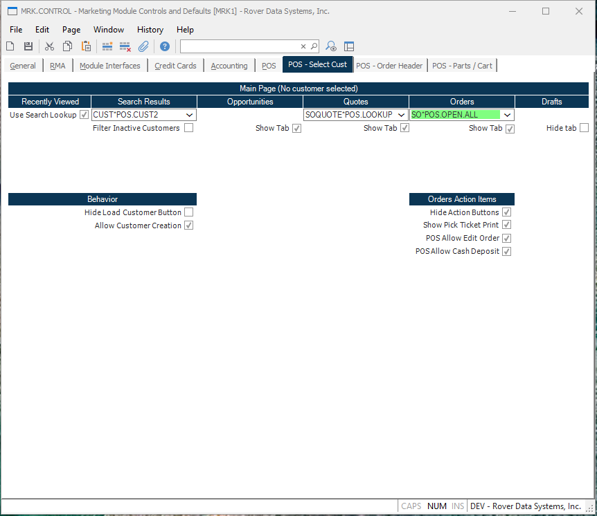

# POS - Select Cust

<PageHeader />

## Overview

These controls are used to configure the Rover Web POS customer selection page.

### Main Page

#### Recently Viewed

#### Search Results

**Customer Lookup** The Customer Lookup tab is used to replace the customer table with a lookup table in the POS main customer tab.

> [Integrations](../../../../../../../../business-suite/integrations/pos/README.md#customer-lookup)

**Filter Inactive Customers** Checking this box will filter inactive customers from the search results.

#### Opportunities

#### Quotes

#### Orders

#### Drafts

### Behavior

**Hide Load Customer Button** Checking this box will hide the load customer button in the main customer search screen.

**Allow Customer Creations** Checking this box will add a "New Customer" button next to the customer search and allow customer creation when a search result returns empty.

### Order Action Items

**Hide Action Buttons** Checking this box will hide the actions buttons that appear on the right side of the orders tables.

**POS Allow Edit Order** Checking this box will add the ability to edit an order within POS.

<badge text= "Version 1.7.19.0" vertical="middle" />

<PageFooter />
