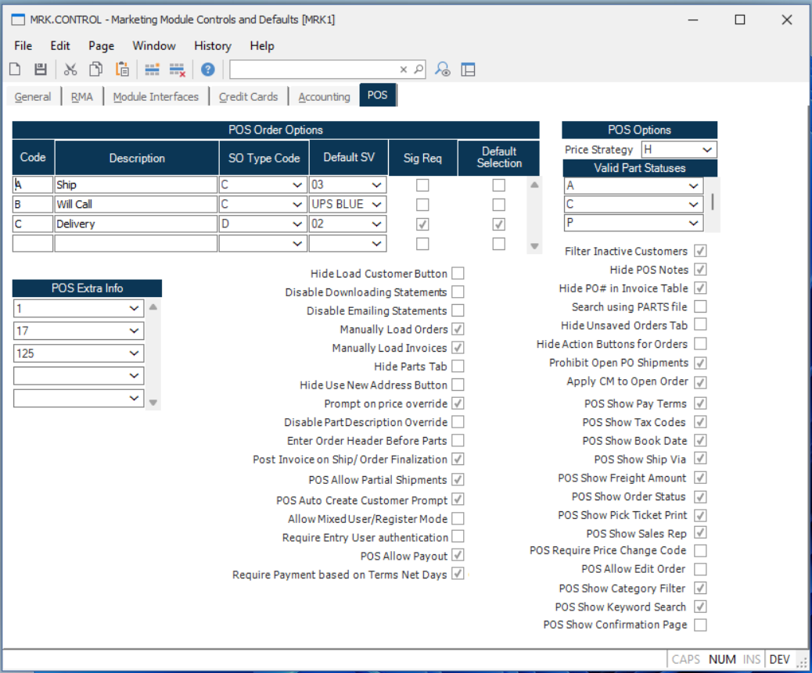

## Marketing Module Controls and Defaults (MRK.CONTROL)

<PageHeader />

## MRK.CONTROL POS Tab

> **Integrations** Use the JSON blocks provided to build up the MRK CONTROL API response. Feature flags will have the value 'Y' to be turned on.



**POS Order Options**

POS Order Options allow grouped type to be using in POS in place of Sales Order `types`. This combines `types` and `Ship Via` as well as the ability to specify if an order requires a signature. 

```
"pos_part_status_items": [
  {
    "pos_part_status": "A"
  },
  {
    "pos_part_status": "C"
  },
  {
    "pos_part_status": "P"
  }
]
```

**POS Options**

**Valid Part Statuses**

The values defined in this table force the selection of parts to only be parts with the specified status.

**POS Extra Info**

Table used to display custom fields in POS Extra Information tab.

```
"pos_extra_info_items": [
  {
    "pos_extra_info": "1"
  },
  {
    "pos_extra_info": "17"
  },
  {
    "pos_extra_info": "125"
  }
]
```

**POS Feature Flags**

| Feature Flag                   | Description                          | JSON                      |
| ------------------------------ | ------------------------------------ | ------------------------- |
| Hide Load Customer Button      | Hide the load customer button in POS | hide_load_customer_button |
| Disable Downloading Statements |                                      |
| Disable Emailing Statements    |                                      |
| Manually Load Orders           |                                      |
| Manually Load Invoices         |                                      |
| Hide Use New Address Button    |                                      |
| Prompt on price override       |                                      |

<PageFooter />
