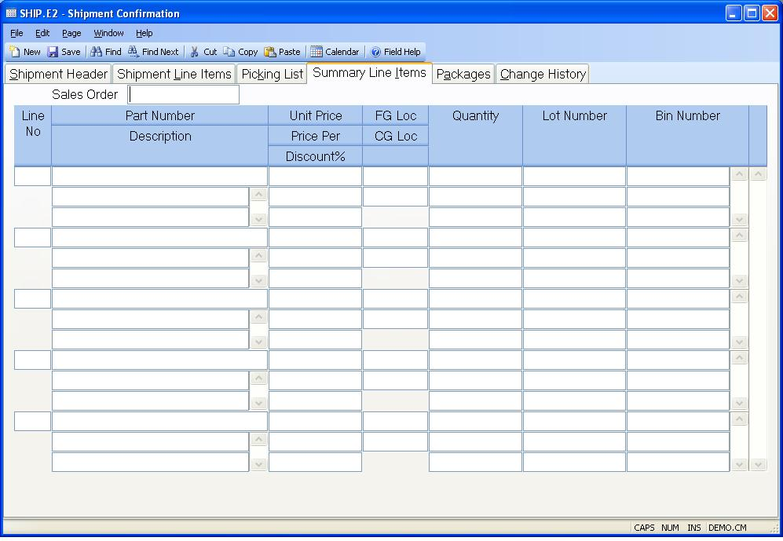

##  Shipment Confirmation (SHIP.E2)

<PageHeader />

##  Summary Line Items

**Sales Order Number** The sales order number for this shipment.  
  
**Line Item** Contains the line item number referenced on this shipment. The
data on this tab is displayed for reference only and cannot be changed.
Changes to this line item can be made on the Shipment Line Items tab.  
  
**Part Number** Contains the part number for this line item. The data on this
tab is displayed for reference only and cannot be changed. Changes to this
line item can be made on the Shipment Line Items tab.  
  
**Part Description** Contains the part description. The data on this tab is
displayed for reference only and cannot be changed. Changes to this line item
can be made on the Shipment Line Items tab.  
  
**Unit Price** Contains the unit price for this line item. The data on this
tab is displayed for reference only and cannot be changed. Changes to this
line item can be made on the Shipment Line Items tab.  
  
**Price Per** Contains the price per for this line item. The data on this tab
is displayed for reference only and cannot be changed. Changes to this line
item can be made on the Shipment Line Items tab.  
  
**Discount Percent** Contains the discount percent to be applied to the
associated line item. The data on this tab is displayed for reference only and
cannot be changed. Changes to this line item can be made on the Shipment Line
Items tab.  
  
**FG Location** Contains the finished goods location for this line item that
the parts will be shipped from. The data on this tab is displayed for
reference only and cannot be changed. Changes to this line item can be made on
the Shipment Line Items tab.  
  
**CG Location** Contains the cost of goods location for this line item. The
data on this tab is displayed for reference only and cannot be changed.
Changes to this line item can be made on the Shipment Line Items tab.  
  
**Quantity** Contains the quantity to be shipped against this line item. The
data on this tab is displayed for reference only and cannot be changed.
Changes to this line item can be made on the Shipment Line Items tab.  
  
**Lot Number** Contains the lot number the associated quantity will be shipped
from. The data on this tab is displayed for reference only and cannot be
changed. Changes to this line item can be made on the Shipment Line Items tab.  
  
**Bin Number** Contains the bin number the associated quantity will be shipped
from. The data on this tab is displayed for reference only and cannot be
changed. Changes to this line item can be made on the Shipment Line Items tab.  
  
  
<badge text= "Version 8.10.57" vertical="middle" />

<PageFooter />