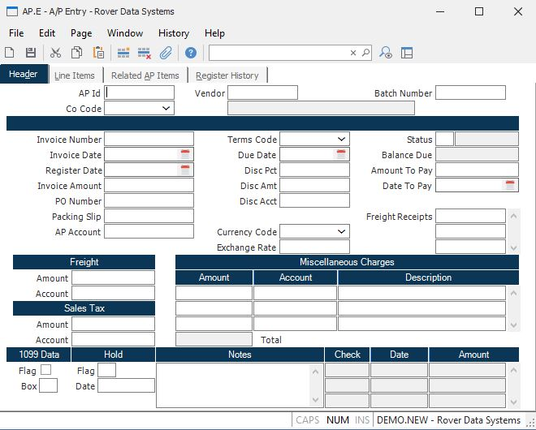

##  A/P Entry (AP.E)

<PageHeader />

##  Header

**AP Id** If you wish to access an A/P record which already exists, enter that
number. If you wish to enter a new A/P record, you may either enter a new ID
now, or leave this field null to assign a new A/P ID when the record is filed.
Additionally, if you know the PO number, but do not know the AP id of the
record you wish to update, an option is provided in the help menu which allows
you to enter a PO number and a list of all AP items with that PO number
assigned.  
  
  
When creating a new AP record do not include a dash in the AP ID. Only records created through a purchase order receipt can contain a dash. If you enter an AP ID that you believe was created from a purchase order receipt and you receive an error message, verify that the receipt was posted. Until a receipt is posted, the AP ID cannot be accessed in this procedure. If the receipt was posted, it is possible that the AP ID was deleted in AP.E and no longer exists. You should be able to verify this by running a report called [ APREG.R2 ](../../../../../rover/AP-OVERVIEW/AP-REPORT/APREG-R2) which will list all APREG entries for a given record id. If the AP ID was deleted it cannot be re-used in AP.E.   
  
There is a load option available from this field to create an invoice/debit memo from an MSHIP record. MSHIP records are created via [ MSHIP.E ](MSHIP-E/README.md) (miscellaneous shipment entry screen) and are generated to return material to a vendor. The vendor information and line item information will be loaded into this screen. However, the unit prices are not entered in [ MSHIP.E ](MSHIP-E/README.md) and will, therefore, need to be entered in this procedure along with the g/l account numbers.   
  
**Co Code** Enter the company codes you wish to appear on this report. If left
blank all company codes will be included.  
  
**Vendor** Enter the vendor number to whom the amount is owed. The vendor
number must exist on the  
Vendor file. If you do not know the vendor's number, there is an option in the
help menu for  
this prompt which allows you to select the vendor by entering the vendor's
name.  
  
**Batch Number** If you wish to keep track of all AP items entered for a
'batch', enter the batch number to use here. This number will be defaulted
into subsequent AP items until you quit from the AP.E procedure.  
  
**Invoice#** Enter the number of the invoice received from the vendor. If this
number is not present, the record is treated as an accrual for goods or
services received which have not yet been invoiced.  
  
**Inv Date** Enter the date which appears on the vendor's invoice. This date
is important when calculating discounts. If you are entering an invoice for a
prior period, be aware that this invoice will now be present on the aging
report if it re-run for that period.  
  
**Register Date** Enter the date that should be posted to the a/p register records and ultimately the general ledger. If the 'default register date to invoice date' option is selected in the [ AP.CONTROL ](../../../../../rover/AP-OVERVIEW/AP-ENTRY/AP-E/CHECKS-E/AP-CONTROL) procedure, the invoice-date will be loaded into this field for you. If that option is not selected, the current date will loaded into this field for you.   
  
If this date is changed on an existing record, the date on the existing APREG records will not be changed. Use [ AP.E2 ](../../../../../rover/AP-OVERVIEW/AP-ENTRY/AP-E2) to change the existing register dates for this invoice. This date will be posted to new APREG records that are created to reflect an amount or account number change.   
  
**Inv Amount** Enter the net amount of the invoice. This is the actual amount
owed to the vendor. The amount entered here must equal:  
Total of all line item amounts  
\+ Miscellaneous amounts  
\+ Freight amount  
\+ Sales tax amount  
\+ Related AP  
  
**PO#** Enter the purchase order number against which this A/P record is being
entered. This is an optional field. If this record was created automatically
by the Purchasing/Receiving process, this number will already be present.  
  
**Pack Slip** Enter the packing slip number which accompanied the material
received.  
  
**AP Acct#** Enter the G/L account number against which this A/P record will be charged. This account number is defaulted from the [ AP.CONTROL ](../../../../../rover/AP-OVERVIEW/AP-ENTRY/AP-E/CHECKS-E/AP-CONTROL) file and can be changed if necessary.   
  
**Terms Code** Enter the terms code which identifies the terms the vendor
agreed to for this A/P record. This is defaulted from the Vendor file and can
be changed for each invoice as required.  
  
**Due Date** The date, based upon the terms, through which the discount date
can be deducted from the invoice amount. For AP items with no discounts, this
date is calculated based upon the net days.  
  
**Discount Pct** Enter the discount percent which applies to this invoice.
This field is loaded automatically from the Terms file and can be changed if
required. If the invoice is paid within the agreed terms, this percentage will
be deducted from the check amount.  
  
**Discount Amt** The discount amount to be deducted from the invoice amount at
the time the check is printed, providing the check date falls within the
agreed terms. This amount is originally calculated automatically when the
invoice amount and terms discount percentage are entered, but can be changed
if required.  
  
**Discount Acct#** Enter the G/L account number against which the discount
amount is being charged.  
  
**Currency Code** If a foreign currency controls this AP record, enter the currency code here. That will load the exchange rate defined in [ CURRENCY.CONTROL ](CURRENCY-CONTROL/README.md) . If this record is from a receipt, the currency code will be loaded in from the purchase order.   
  
**Exchange Rate** This is the exchange rate associated with the currency code as defined in [ CURRENCY.CONTROL ](CURRENCY-CONTROL/README.md) . It can be changed as needed.   
  
**Status** This field indicates the status of this A/P item: A = Accrual (no
invoice), O = Open, P = Precheck Processing and C = Closed (paid). You cannot
change the status on a record in a "P" or "C" status. To re-open an invoice,
you need to change the invoice and misc/distribution amounts. When the record
is saved, the system will change the status for you to "O".  
  
You may, however, close an invoice in a "O" or "A" status by changing the
status to "C" provided no payments have been applied and no related A/P items
have been entered for this invoice. When the record is saved, you will be
asked to confirm that the open amount on the invoice should be cancelled (i.e.
set to zero). If you select this option, all amounts on the invoice will be
set to zero and register records will be created in the APREG file to back the
money out of the accounts they were posted to. Whatever date is in the
REGISTER DATE field on the HEADER tab will be the date posted to the APREG
records and ultimately the g/l. The invoice number, invoice date and register
date need to be entered for records in an accrual status.  
  
**Balance Due** This is the current balance due of this AP item.  
  
**Amount To Pay** Enter the amount to pay when the next check is generated
against this A/P item. This field can be used to control partial payments, or
pay the entire amount. It is originally calculated to be the net amount due
when the items are entered, but can be changed as desired for payment control.
This is the field which the checks creation procedure will check to find valid
A/P items to pay.  
  
**Date To Pay** Enter the date on which you wish to have a check generated to
pay this A/P item. This date is originally calculated based upon the terms,
but can be changed in conjunction with the amount to pay field as required.  
  
**Receipt Ids Freight Paid** If this AP record is paying freight for another
AP record (receipt), enter the receipt numbers here. This is for the purpose
of reporting actual freight bills against estimated freight entered on the
purchase order when a different vendor is billing for the freight.  
  
**Freight Amt** Enter the freight amount which is being charged on this
invoice.  
  
**Freight Acct#** Enter the G/L account number to which the freight amount is
being charged.  
  
**Tax.Amt** The amount of sales tax due for the AP invoice being processed.  
  
**Tax.Acct** The general ledger account for sales tax paid.  
  
**Misc Amounts** Enter any miscellaneous amounts which have been added to the
invoice. This field is multi-valued and can contain any number of amount,
associated with the miscellaneous descriptions and account numbers.  
  
**Misc Acct#** Enter the account number to which the miscellaneous amount is
being distributed.  
  
**Misc Desc** This field will default to the description of the associated
account number, as found in the  
GLCHART file. It may be overridden, if desired, to a more specific
description.  
  
**1099** Check this box if this item should be included on a 1099 report for
this vendor. This field is defaulted from the Vendor file, but can be changed
if required.  
  
**1099 Box** Enter the box on the 1099 form which is to contain the amount
paid against this item. If this is left empty, the non employee compensation
box will be used.  
  
**Hold Flag** Enter any user-defined code in this field to place the A/P item
on hold. This will prevent any payments against this item until the hold flag
is removed.  
  
**Hold Date** Enter the date on which the hold flag was placed on this record.  
  
**Notes** Enter any notes which apply to this A/P item.  
  
**Checks** This field is under system control and is for display only. These
are the checks which have been written against this A/P record. This can also
represent a payment made by another AP record.  
  
**Check Dates** This field is under system control and is for display purposes
only. It contains the check dates for the checks written against this A/P
record.  
  
**Check Amounts** This field is under system control and is for display
purposes only. It contains the check amounts for the checks written against
this A/P record.  
  
**Vendor Name** This is the vendor name as read from the Vendor file.  
  
**Status Desc** This is a descriptive field used to identify the status code.  
  
**Total Misc** This field contains the total of the miscellaneous charges
above.  
  
  
<badge text= "Version 8.10.57" vertical="middle" />

<PageFooter />