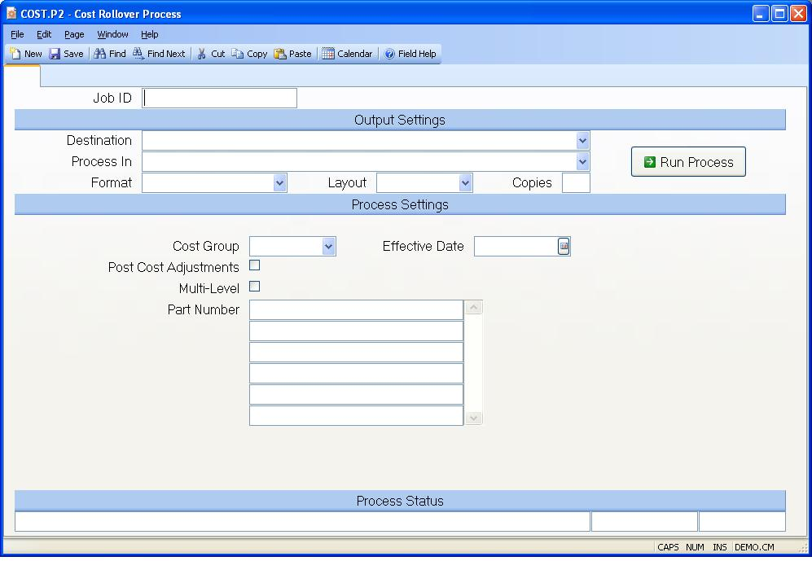

##  Cost Rollover Process (COST.P2)

<PageHeader />

##

**Job ID** Enter a unique ID if you wish to enter and save the parameters to
this procedure for future use. If you only need to run the procedure and do
not want to save your entry then you may leave this field empty.  
  
**Destination** Select the destination for the output from this procedure.  
  
**Process** Select the method to be used for processing the report. Foreground
is always available and must be used when output is directed to anything other
than a system printer (i.e. printers spooled through the database on the host
computer.) Depending on your setup there may be various batch process queues
available in the list that allow you to submit the job for processing in the
background or at a predefined time such as overnight. A system printer must be
specified when using these queues.  
  
**Format** Select the format for the output. The availability of other formats
depends on what is allowed by each procedure. Possible formats include Text,
Excel, Word, PDF, HTML, Comma delimited and Tab delimited.  
  
**Layout** You may indicate the layout of the printed page by specifying the
appropriate setting in this field. Set the value to Portrait if the page is to
be oriented with the shorter dimension (usually 8.5 inches) at the top or
Landscape if the longer dimension (usually 11 inches) is to be at the top.
Portrait will always be available but Landscape is dependent on the output
destination and may not be available in all cases.  
  
**Copies** Enter the number of copies to be printed.  
  
**Run Process** Click on the button to run the process. This performs the save
function which may also be activated by clicking the save button in the tool
bar or pressing the F9 key or Ctrl+S.  
  
**Cost Group** Enter the cost group which will be validated against [ INV.CONTROL ](../../../../../../../../../rover/AP-OVERVIEW/AP-ENTRY/AP-E/AP-E-2/INV-CONTROL) . The cost group is used to define the costing method and to group inventory locations together for averaging the cost within those locations.   
  
**Post Cost Adjustments?** Check this box if the adjustments resulting from
the cost rollover process are to be posted to the inventory register.
Otherwise leave unchecked. This option is automatically set to unchecked
unless the inventory costing method for the chosen cost group is standard. If
this option is selected, the date the process is run on will be the date
posted to the inventory register records.  
  
**Multi-Level?** If the cost rollover is being done for a specific assembly
part number and you want a multi-level cost rollover, then check this box. If
a rollover is being done for all part numbers, then this doesn't apply since
it will already be doing a multi-level rollover.  
  
**Part Numbers** If you want to rollover all of the part numbers then leave
this field blank. If you want to rollover specific assemblies then enter the
part numbers of those items in this field. If the assembly has subassemblies,
be sure to check the multi-level option to include costs for the entire BOM
structure. If all part numbers are being processed, then all work centers will
be updated for standard costs using WC current costs (if current costs are
present).  
  
**Effective Date** Enter the date to be used for the bill of material
effectivity date. Bill of material line items will be included or excluded
based on the start and end effectivity dates for each item relative to the
date entered. This will only be used if the multi-level option is checked.  
  
**Last Status Message** Contains the last status message generated by the
program.  
  
**Last Status Date** The date on which the last status message was generated.  
  
**Last Status Time** The time at which the last status message was generated.  
  
  
<badge text= "Version 8.10.57" vertical="middle" />

<PageFooter />