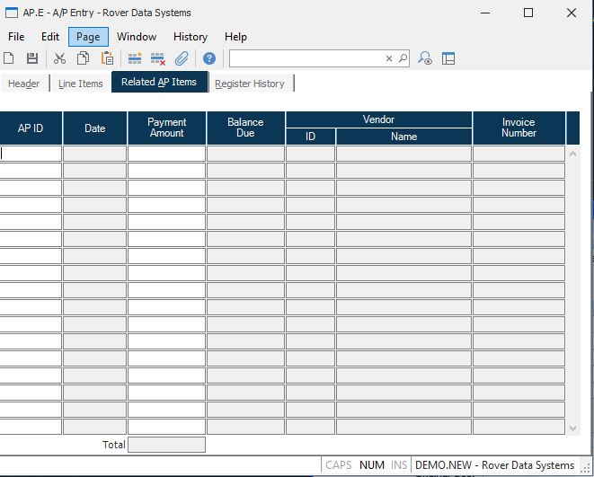

##  A/P Entry (AP.E)

<PageHeader />

##  Related AP Items

**Related AP** Enter an existing AP ID to be paid by this AP and Vendor.
Options are available to lookup AP ID's.  
  
**Related AP Date** This is the Invoice date if the AP was invoiced; otherwise
the receipt date is displayed.  
  
**Related AP Amount** Enter the amount to pay on the related AP. It must be
less than or equal to the balance due. It will default to the balance due when
the AP is entered. For existing records the amount shown here is what was paid
previously. It can be changed if needed. A zero amount cannot be entered, so
if a payment was made in error, it can be deleted by deleting the whole line.  
  
**Related AP Balance** This is the balance due or the accrual amount of the
related AP ID. For existing records that have already made payments for the
related AP, the balance due will include those payments so the amount shown
here indicates the total that can be paid by this record.  
  
**Related Vendor** The vendor ID associated with the AP entered.  
  
**Related Vendor Name** The vendor name associated with the AP entered.  
  
**Related AP Invoice** The invoice number associated with the AP entered.  
  
**Total related payments** This is the total of all of the payment amounts
entered on this tab.  
  
  
<badge text= "Version 8.10.57" vertical="middle" />

<PageFooter />