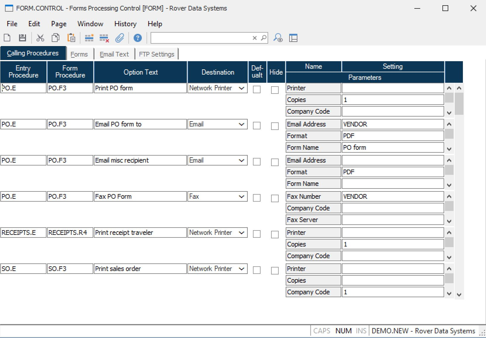

##  Forms Processing Control (FORM.CONTROL)

<PageHeader />

##  Calling Procedures

**Control ID** The control id is the company code (as defined on screen 2 of
CO.CONTROL) preceded by "FORM". If you only have one company code the control
id will automatically be inserted into this procedure for you. If you have
multiple company codes you may select from a list of available companies or
you may enter the id directly e.g. FORM2.  
  
**Entry Procedure** Enter the name of the data entry procedure that is to
include the associated output option.  
  
**Form Procedure** Enter the name of the procedure that is used to produce the
form.  
  
**Option Text** Enter the text that is to appear on the list of options for
the associated form.  
  
**Destination** Enter the destination for the output. The following options
are available:  
  
Server Printer (SVR)  
Sends output to a printer that is defined in PRINTER.CONTROL as a server
printer. These printers are defined on the Windows server hosting the
M3Services service.  
  
Network Printer (NET)  
Sends output to printers defined on the users computer or a printer on the
network that can be accessed by their computer.  
  
System Printer (SYS)  
Sends output to printers defined in PRINTER.CONTROL on the System Printers
page. These printers are visible from the server hosting M3. Output derived
from a PDF document can not be printed on these printers.  
  
Email (EMAIL)  
Generates output that is attached to an email generated by the email client on
the users computer.  
  
Email Server (EMAILSVR)  
Generates output that is attached to an email generated on the server hosting
M3Services.  
  
Fax (FAX)  
Generates output that is faxed through the users computer or a shared Windows
fax server.  
  
File (FILE)  
Sends output to a file on the users computer or a network path that is
accessible by their computer.  
  
File Server (FILESVR)  
Sends output to a file on the server hosting M3Services or a path accessible
to the server.  
  
Attachment (ATTCH)  
Generates output that is attached to the specified record in the database.  
  
**Default** Check this box if the option is to be defaulted as selected when
presented to the user.  
  
**Hide** Check this box if the option is to be hidden from the user. If you
check this box and also check the Def (default) checkbox the option will be
automatically executed without presenting the option to the user. If you check
this box and the Def (default) box is not checked the option is essentially
disabled.  
  
**Parameter Name** Displays the name of each parameter that must be defined in
the associated settings field.  
  
**Parameter Setting** Enter the setting for the associated parameter.  
  
  
<badge text= "Version 8.10.57" vertical="middle" />

<PageFooter />