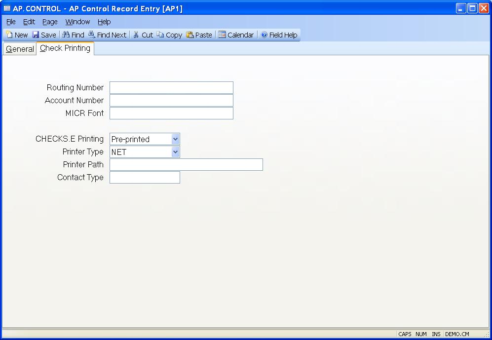

##  AP Control Record Entry (AP.CONTROL)

<PageHeader />

##  Payments

**Routing Number** If you are printing your checks on blank paper stock using
a laser printer with a magnetic ink cartridge you must specify the bank
routing number to be included in the MICR code printed at the bottom of the
check. The routing number is the second group of numbers that appears at the
bottom of the check.  
  
**Account Number** If you are printing your checks on blank paper stock using
a laser printer with a magnetic ink cartridge you must specify your bank
account number to be included in the MICR code printed at the bottom of the
check. The account number is the third group of numbers that appears at the
bottom of the check.  
  
**MICR Font** If you are printing your checks on blank paper stock using a laser printer with a magnetic ink cartridge you must specify the name of the MICR font to be used when printing the check. This font must be installed on the client computer that is running the [ CHECKS.F5 ](../../../../../../../rover/AP-OVERVIEW/AP-REPORT/CHECKS-F5) procedure for printing the checks.   
  
**CHECKS.E Printing** The [ CHECKS.E ](../../../../../../../rover/AP-OVERVIEW/AP-ENTRY/AP-E/CHECKS-E) procedure provides the ability to create checks one at a time instead of through a check run. You have the option of printing the check automatically when the check is saved by setting the appropriate option in this field. If the field is left blank or is set to "Disabled" then users of [ CHECKS.E ](../../../../../../../rover/AP-OVERVIEW/AP-ENTRY/AP-E/CHECKS-E) will not be presented with the option to print the check. To enable this option select either "Blank Stock" or "Pre-printed". Select blank stock when the checks your are printing on are blank and contain no formatting or company information. The [ CHECKS.F5 ](../../../../../../../rover/AP-OVERVIEW/AP-REPORT/CHECKS-F5) procedure will be invoked to print the check in this case. Select Pre-printed for check stock that is already formatted and contains company information and MICR codes. Note: This is not compatible with continous tractor feed forms used in impact printers. Also, you must setup a path to the pdf document that defined the check layout in [ FORM.CONTROL ](FORM-CONTROL/README.md) when using Blank Stock.   
  
**Printer Type** Enter "SYS" if the printer being used is a system printer
spooled from the database, or "NET" if the printer is defined as a network or
directly connected printer.  
  
**Printer Path** If the printer is defined as a system printer enter the
number associated with it in this field. If it's defined as a network printer
enter the full path to the printer or leave the field blank. Leaving the field
blank will cause a message to appear asking the operator which printer to use
when they create the check. If you do enter a path for a network printer, be
sure to us a path that is universal to all client computers that may use the
check procedure.  
  
**Contact Type** This field will be used when printing a payment notification form ( [ CHECKS.F6 ](../../../../../../../rover/AP-OVERVIEW/AP-REPORT/CHECKS-F6) ) from [ CHECKS.E ](../../../../../../../rover/AP-OVERVIEW/AP-ENTRY/AP-E/CHECKS-E) . This form is usually sent to the vendor for electronic payments. If you wish the first contact entered in the vendor or rep record to appear on the form, enter FIRST in this field. If you wish to print contacts for a pre-defined type code (e.g. AR), enter the type code in this field. If you do not wish to print a contact on the form, leave this field blank.   
  
**Service Provider** Select the service provider that will be used to process
electronic payments.  
  
**Provider Account** If you are using an electronic payment service then enter
the account id assigned to you by the service company (i.e. Paymode-X).  
  
**Export File Path** Enter the export path to be used when sending data to the EPayment service provider using [ CHECKS.P7 ](../../../../../../../rover/AP-OVERVIEW/AP-PROCESS/CHECKS-P7) . Please note that the payment data to be exported will be saved in a text file that can than be loaded into the service provider's software.   
  
**Record ID** Enter the name of the export (i.e. record) id that data will be
written to. This text file will then be read by the payment provider and
imported into their system.  
  
  
<badge text= "Version 8.10.57" vertical="middle" />

<PageFooter />