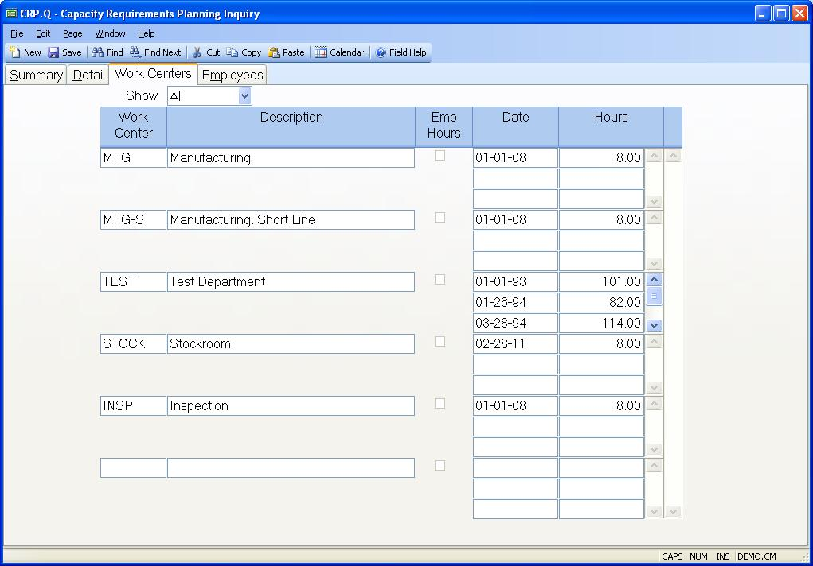

##  Capacity Requirements Planning Inquiry (CRP.Q)

<PageHeader />

##  Work Centers

**Update WC Show** Select "All" to display all of the work centers or "What
If" to display only those that are included in the routing for the What If
settings.  
  
**Update Work Center** Displays each work center that is used with capacity
planning.  
  
**Update WC Description** Displays each work center description.  
  
**Update WC Date** Displays the dates that determine how much capacity will
become available on a given date based on the entry in the associated hours
field. The capacity hours specified are used in the capacity calculations
until the next date entered. For example, if your regular capacity hours for a
day were 80 you would enter a date on or before the current date in this field
with 80 in the associated hours field. If you planned to add 10 additional
hours in the future you would enter the date on which the new hours would
being in the next date field and 90 in the associated hours field. The
previous date may be removed after the new date has passed if desired.  
  
**Update WC Hours** Displays the hours that are to be used for capacity
planning beginning on the associated date.  
  
**Uses employee hours** If this box is checked it indicates that the hours
available in the associated work center are based on the sum of the hours
defined for individual employees and may not be updated at the work center
level.  
  
  
<badge text= "Version 8.10.57" vertical="middle" />

<PageFooter />