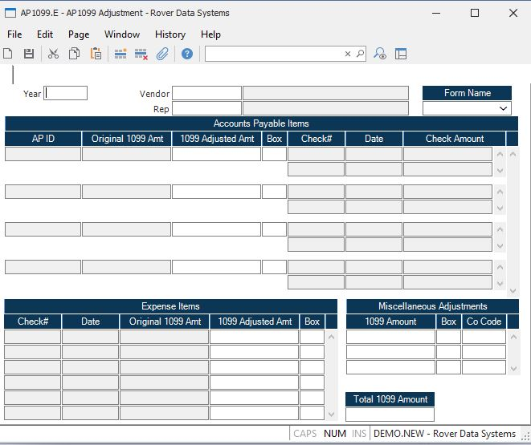

##  AP1099 Adjustment (AP1099.E)

<PageHeader />

##

** ** The record ID will be programmatically assigned based on year and
vendor/rep entry.  
  
**Year** Enter the year for updating the 1099 file. This must be entered as a
four digit year.  
  
**Vendor** Enter the vendor number you wish to update.  
  
**Rep** Enter the rep number you wish to update.  
  
**Vendor Name** The vendor name.  
  
**Rep Name** The rep name.  
  
**Form Name** Enter the form that should be used when printing the 1099 for this vendor or rep. If no entry is made in this field, it is assumed that the 1099-MISC form should be used. The [ AP1099.F1 ](../../../../../rover/AP-OVERVIEW/AP-REPORT/AP1099-F1) and [ AP1099.F2 ](../../../../../rover/AP-OVERVIEW/AP-REPORT/AP1099-F2) procedures are used to print the 1099-MISC forms and will exclude any records that have a form of 1099-INT entered in this field. The [ AP1099.F3 ](../../../../../rover/AP-OVERVIEW/AP-REPORT/AP1099-F3) procedure is used to print the 1099 interest forms and will only include records with a form name of 1099-INT.   
  
**Ap Id** The accounts payable ID.  
  
**AP Pay Amt** The original 1099 amount for the AP item as calculated from the check payments and the 1099 flag specified when [ AP.P7 ](../../../../../rover/AP-OVERVIEW/AP-PROCESS/AP-P7) was run. This is shown for information only and cannot be changed.   
  
**Ap 1099 Amt Adjusted** This will originally be equal to the 1099 amount in the previous prompt. If you want to manually override the amount, change this entry. Warning! Rerunning [ AP1099.P1 ](../../../../../rover/AP-OVERVIEW/AP-REPORT/AP1099-R1/AP1099-P1) will override this entry.   
  
**AP 1099 Box** This is the 1099 form box number from the AP record. You may change this box number here if needed. Warning! Rerunning [ AP1099.P1 ](../../../../../rover/AP-OVERVIEW/AP-REPORT/AP1099-R1/AP1099-P1) will override this entry.   
  
**Ap Check Id** These are the check numbers for the associated AP item that
were issued during this 1099 year.  
  
**Ap Check Date** The check date.  
  
**Ap Check Amt** The check amount. This is shown for information only and
cannot be changed.  
  
**Misc Check Id** These are the check numbers for miscellaenous expense items
or rep commission checks that were flagged for 1099.  
  
**Check Date** The check date.  
  
**Check 1099 Amt** The original 1099 amount for the check as calculated from the 1099 flag specified when [ AP.P7 ](../../../../../rover/AP-OVERVIEW/AP-PROCESS/AP-P7) was run. This is shown for information only and cannot be changed.   
  
**Check Adjusted 1099 Amount** This will originally be equal to the 1099 amount in the previous prompt. If you want to manually override the amount, change this entry. Warning! Rerunning [ AP1099.P1 ](../../../../../rover/AP-OVERVIEW/AP-REPORT/AP1099-R1/AP1099-P1) will override this entry. This can also be modified in [ CHECKS.E3 ](../../../../../rover/AP-OVERVIEW/AP-ENTRY/CHECKS-E3) .   
  
**Check 1099 Box** This is the 1099 form box number from the Vendor or Rep record. You may change this box number here if needed. Warning! Rerunning [ AP1099.P1 ](../../../../../rover/AP-OVERVIEW/AP-REPORT/AP1099-R1/AP1099-P1) will override this entry.   
  
**Misc Amt** If you wish to adjust the total 1099 amount that has been calculated from the accounts payable and/or checks, enter the adjustment amount here. This box can be used to enter an amount that was paid to a vendor out of another software package and is not being reported in M3. Warning! Rerunning [ AP1099.P1 ](../../../../../rover/AP-OVERVIEW/AP-REPORT/AP1099-R1/AP1099-P1) will override this entry.   
  
**Misc 1099 Box** Enter the box on the 1099 form that the money should be reported against. If this is left empty, the non employee compensation box will be used. Warning! Rerunning [ AP1099.P1 ](../../../../../rover/AP-OVERVIEW/AP-REPORT/AP1099-R1/AP1099-P1) will override this entry.   
  
**Misc Co Code** Enter the company code that should be applied to this adjustment. Warning! Rerunning [ AP1099.P1 ](../../../../../rover/AP-OVERVIEW/AP-REPORT/AP1099-R1/AP1099-P1) will override this entry.   
  
**Total 1099 Amount** This field contains the total 1099 amont that will be reported for the above vendor/rep for all company codes. This is a calculated amount and cannot be changed. Warning! Rerunning [ AP1099.P1 ](../../../../../rover/AP-OVERVIEW/AP-REPORT/AP1099-R1/AP1099-P1) may cause this amount to change.   
  
  
<badge text= "Version 8.10.57" vertical="middle" />

<PageFooter />