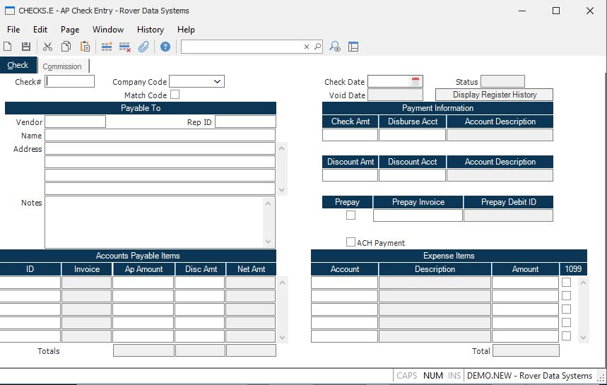

##  AP Check Entry (CHECKS.E)

<PageHeader />

##  Check

**Check#** Entering Regular Checks:  
Enter the number of the hand check which you are logging into the system. As
checks should already have been manually prepared, you must enter a check
number. If you enter a number of a check which already exists on file, the
only option you will have is to delete that check. No changes are allowed to
an existing check record, for audit purposes.  
  
Applying Prepayments:  
Enter the letter "A" in the check number field. This will indicate that you
are entering a zero dollar check record for the purpose of applying
prepayments or other debit AP's against invoices. You must enter AP ID's that
sum to zero. The expense section must be left blank.  
Upon filing, a sequential number will be created for the zero check, prefixed
with "A".  
  
**Company Code** Enter the company code for this check. The company code must
be pre-defined in the CO.CONTROL procedure. If only one code exists, it will
automatically be inserted into this procedure for you.  
  
**Match Co Code** Check this box if the company code posted to the a/p records
needs to match the company code entered in this procedure.  
  
**Check Date** Enter the date which appears on the check.  
  
**Void Date** The date this check was voided. It is displayed here for
reference only and cannot be changed.  
  
**Status** Displays the current status of the check. This may be one of the
following:  
Posted - Check has been created and posted.  
Voided - Check has been voided.  
Stopped - Payment on the check has been stopped.  
Cleared - Payment has cleared the bank.  
  
There is a lookup option available from this field to display the recon id
that the check was cleared against.  
  
**Display Register History**  
  
**Vendor#** Enter the vendor number to which the check is being issued. If
this is for a one-time or miscellaneous vendor, leave this field null. If left
null, the A/P records will not be entered. This feature is useful for logging
non-AP related checks. If you do not know the number of the vendor, there is
an option in the help menu for this prompt which allows you to select the
number by entering the vendor's name. f the vendor is flagged for 1099
reporting, the 1099 flag will be defaulted for each expense amount entered.  
  
**Rep Id** If this check is for a rep instead of a vendor, enter the rep ID
here. If the rep is flagged for 1099 reporting, the 1099 flag will be
defaulted for each expense amount entered.  
  
**Name** Enter the name of the vendor for which you are creating a check. If
this field is left blank and there is a vendor number present, the name in the
vendor file will be used.  
  
**Address** Enter the address of the vendor for which you are creating a
check. If this field is left blank and there is a vendor number present, the
address in the vendor file will be used.  
  
**Notes** Enter any notes applicable to this check. The first line, up to 16
characters, will be printed on the check stub.  
  
**Check.Amt** Enter the amount for which the check was issued. This is the
actual amount paid by the check. If there is a discount amount being applied,
this amount will be the total of the AP items being paid, less the discount
amount entered.  
  
**Disb.Acct#** Enter the G/L account number from which this check is being paid. This account number is defaulted from the [ AP.CONTROL ](../../../../../../rover/AP-OVERVIEW/AP-ENTRY/AP-E/CHECKS-E/AP-CONTROL) record and may be changed if desired.   
  
**Disb Acct Desc**  
  
**Disc.Amt** Enter the amount of discount which was taken on this check. This
is the total discount for all AP items being paid.  
  
**Disc.Acct#** Enter the G/L account number which is being credited for the discount amount. This is defaulted from the [ AP.CONTROL ](../../../../../../rover/AP-OVERVIEW/AP-ENTRY/AP-E/CHECKS-E/AP-CONTROL) file and may be changed if desired.   
  
**Disc Acct Desc**  
  
**Prepay** Check this box if this is a prepayment check. Prepayments will
create a debit record in the accounts payable file to indicate that a prepaid
amount is available for application against future, or current invoices.  
  
**Invoice No** This invoice # is used for prepayments. It will be loaded into
the invoice number field of the AP debit record created.  
  
**Debit Id** For prepayment checks, this is the debit AP ID created as a
result of the prepayment. It is shown for information only, and cannot be
changed. If this check has been subsequently voided, then this debit ID will
be deleted from the AP file.  
  
**AP.Ids** Enter the AP records which were paid by this check. This field is
associated with the AP amounts field. If you wish to load all open AP items
for this vendor, press the help key. Only 13 invoices may be entered for a
single hand check entry.  
  
**AP.Amounts** Enter the amounts for each AP record which is being paid by
this check. The amount which defaults in this field is the balance of the AP
item. This may be changed to an amount less than the balance, but never
greater. If the AP item being "paid" is a debit memo, the amount is entered as
a negative number.  
  
**AP Disc Amts**  
  
**Net Amount** This field contains the net amount that will be paid on the
invoice. The net amount is the AP amount minus the discount amount. This field
is displayed for reference only and cannot be changed.  
  
**Total AP** The total amount of the AP items specified. This is used to
display the running total of the items being paid.  
  
**Expense Acct** If you are paying non-AP related expenses, enter the expense
account to which you wish to distribute amounts.  
  
**Exp Acct Desc** This field contains the description of the GL account.  
  
**Expense Amount** Enter the expense amount for the associated account number.  
  
**1099** Check here if this expense item will be included in 1099 reporting
for the vendor or rep. If this check number is not related to a vendor or rep
number, then this box cannot be checked.  
  
**Total Misc Amount** This field is the total of all of the expense amounts
listed above.  
  
**Total Ap Disc Amount** The total discount amount for all accounts payable
invoices. This amount cannot be greater than the discount amount entered for
the check.  
  
**Total Net Amount** This field contains the total amount to be paid for these
invoices. This total plus the total of the expense items should equal the
check amount.  
  
  
<badge text= "Version 8.10.57" vertical="middle" />

<PageFooter />