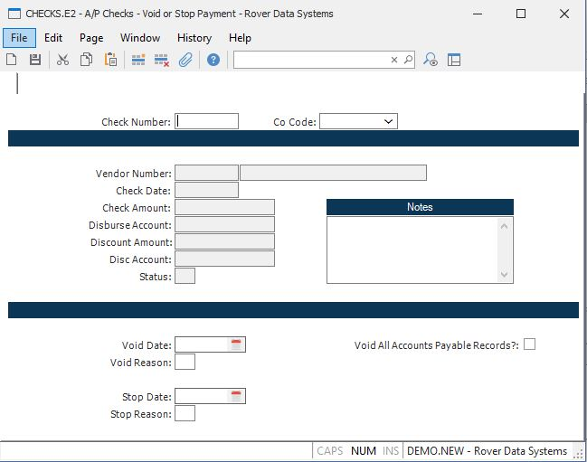

##  A/P Checks - Void or Stop Payment (CHECKS.E2)

<PageHeader />

##

**Check#** Enter the check number which you are voiding or on which you have
placed a stop payment with the bank.  
  
**Co Code** Enter the company code for this check. The company code must be
pre-defined in the CO.CONTROL procedure. If only one code exists, it will
automatically be inserted into this procedure for you. If this is an existing
record the company code will be automatically loaded in for you and cannot be
changed.  
  
**Vendor#** Enter the vendor number to which the check is being issued. If
this for a one-time or  
miscellaneous vendor, leave this field null. If left null, the A/P records
will not be entered. If a vendor number is entered, the Vendor name will
display to the right of this prompt.  
  
**Check.Date** Enter the date which appears on the check.  
  
**Check.Amt** Enter the amount for which the check was issued.  
  
**Disb.Acct#** Enter the G/L account number from which this check is being
paid.  
  
**Disc.Amt** Enter the amount of discount which was taken on this check.  
  
**Disc.Acct#** Enter the G/L account number which is being credited for the
discount amount.  
  
**Status** The status of this check record. P = Posted V = Void S = Stop
Payment C =  
  
**Notes** Enter any notes applicable to this check.  
  
**Void Date** Enter the date on which this check is being voided. When you
void a check (as opposed to placing a stop payment on a check), the a/p
records originally paid by this check are re-opened and apreg records are
created to offset the original check entry.  
  
**Void Reason** Enter a reason code for the voiding of this check. This is a
user defined field which allows you to categorize void types.  
  
**Stop Date** Enter the date on which you placed the stop pay with the bank.
When a stop payment is issued, no updates will be made to the a/p records
originally paid by this check and no updates will be made in the apreg file.
There is usually a short window of time after a stop payment is placed on a
check with the bank that the check can still be cleared. Once the stop payment
has been confirmed, the check should be voided. As part of the void process,
the a/p records will be re-opened.  
  
**Stop Pay Reason** Enter the reason code for the stop pay order. This is a
user defined field allowing you to categorize the stop pay items.  
  
**Void Ap** Check this box if you wish to void all accounts payable invoices
paid against this check. The amounts on the invoices will be set to zero and
all necessary APREG records created for you. The AP record will still exist in
the a/p file and can be reopened if required. The void date will become the
register (i.e. g/l date) used in these transactions. However, if the void date
is before the last register date used on the A/P record, the last register
date will be used and not the void date.  
Warning: If the AP record has multiple payments/checks posted against it or was created from a "pre-payment" check, you will not be able to void it. You will be given the option to void all additional invoices against the check but will have to use [ AP.E ](../../../../../rover/AP-OVERVIEW/AP-ENTRY/AP-E/README.md) to void these records.   
  
**Vendor.Name** The name of the vendor to which the check is being paid.  
  
  
<badge text= "Version 8.10.57" vertical="middle" />

<PageFooter />