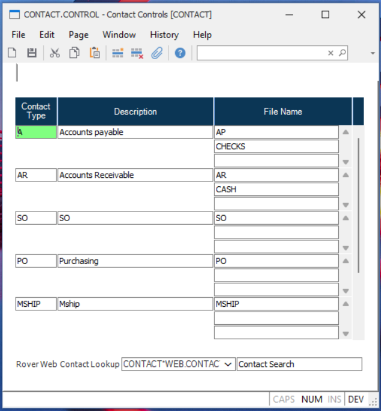

##  Contact Controls (CONTACT.CONTROL)

<PageHeader />

##

**Control ID** The ID "CONTACT" is automatically assigned by the procedure.  
  
**Contact Id** Enter the contact id that you want as the primary contact for the associated files. The data for the contact will be entered in [ CUST.E ](CUST-E/README.md) or [ VENDOR.E ](../../../../../rover/AP-OVERVIEW/AP-ENTRY/VENDOR-E/README.md) .   
  
**Description** Enter a description for the associated contact if desired.  
  
**FILE.NAME** Enter the file name you want associated with this contact. For
example, to use this contact in  
reports for the Accounts Receivable module, enter AR in this field.  

## Contact Lookup

This defines the lookup used for Rover Web. This allows for greater flexibility in the lookup for contacts. This is enabled for Tickets, Opportunities, Quotes, Orders, and Customers.

[Integrations](../../../../business-suite/integrations/contact-control/README.md#contact-lookup)
  
  
<badge text= "Version 8.10.57" vertical="middle" />

<PageFooter />