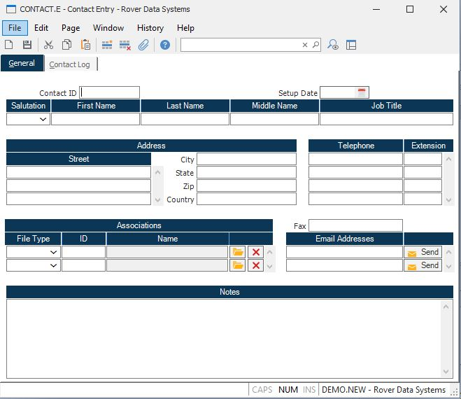

##  Contact Entry (CONTACT.E)

<PageHeader />

##  General

**Contact ID** This field contains the unique key that identifies the contact.
When adding a new contact you would normally leave this field blank and allow
the system to assign the Contact ID. However, you do have the option of
assigning a Contact ID of your choice if you prefer. If you want to view,
modify or delete an existing contact you may access it by entering the Contact
ID, if you know it, or entering a full or partial word from the contact's
name.  
  
**Setup Date** This date represents when the contact was added to the system.
The current date will be loaded automatically when a new contact is entered,
but it may be changed if required.  
  
**Salutation** Select the salutaion to be associated with the contact. Options
are Mr. Ms. Mrs. Miss or Dr.  
  
**First Name** Enter the first name of the contact.  
  
**Last Name** Enter the last name of the contact.  
  
**Middle Name** Enter the middle name or initial of the contact.  
  
**Job Title** Enter the job title of the contact.  
  
**Address** Enter the street address for the contact.  
  
**City** Enter the city associated with the street address.  
  
**State** Enter the two character abbreviation for the state associated with
the address.  
  
**Zip** Enter the zip or postal code associated with the address.  
  
**Country** Enter the country associated with the address.  
  
**Telephone** Enter the various telephone numbers associated with the contact.  
  
**Telephone Ext** Where appropriate enter the extension of the associated
telephone number. This field may also be used for other designations such Cell
or Home.  
  
**Fax** Enter the fax number associated with the contact.  
  
**Email Address** Enter the email address for the contact. The right click
menu provides an option that allows you to send an email to the contact.  
  
**Send** Click this button to send and email to the contact.  
  
**Assoc Type** A contact may be associated with one or more master file
entities. Associating the contact with the entities will cause them to appear
as contacts for those entities so any activity associated with the contact
will also be associated with the entity. These include Customers, Prospects
and Vendors.  
  
**Assoc Id** Enter the ID for the associated type. You may enter all or part
of a word from the name of the associated entity (Customer, Vendor, Prospect
etc.) to lookup the id.  
  
**Assoc Name** Displays the name of the associated entity.  
  
**** Click this button to open the associated item.  
  
**** Click this button to remove the item from the association.  
  
**Notes** This field provides an area for general notes regarding the contact.  
  
  
<badge text= "Version 8.10.57" vertical="middle" />

<PageFooter />