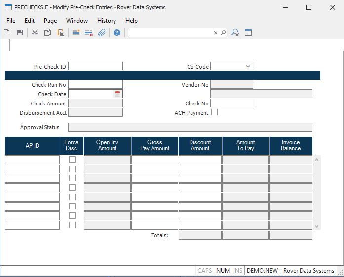

##  Modify Pre-Check Entries (PRECHECKS.E)

<PageHeader />

##

**Seq** Enter Prechecks ID/Sequence number to be edited. Run [ PRECHECKS.R1 ](../../../../../rover/AP-OVERVIEW/AP-REPORT/PRECHECKS-R1) to obtain ID listing.   
  
**Co Code** The company code for this precheck record. This field is for
reference only and cannot be changed. Any A/P items which are added to this
record must have a matching company code.  
  
**Run** Check Run Number Assigned by System during [ AP.P1 ](../../../../../rover/AP-OVERVIEW/AP-REPORT/CHECKS-F5/AP-P1) procedure.   
  
**Check Date** Date that will print on check.  
  
**Check.Amt** Total amount of check to pay for this vendor. This amount is
calculated by subtracting the discount amount from the gross pay amount. It is
displayed for reference only and cannot be changed. NOTE: More than 1 check
may have been issued to this vendor.  
  
**Disb.Acct** Distribution Account check amounts will be posted to. Cannot be
edited via this program.  
  
**Vendor** Vendor selected for payment in [ AP.P1 ](../../../../../rover/AP-OVERVIEW/AP-REPORT/CHECKS-F5/AP-P1) .   
  
**Vendor Name** Vendor Name associated with Vendor Id in the Vendor file.  
  
**Check** Check # Assigned by system during [ CHECKS.F1 ](../../../../../rover/AP-OVERVIEW/AP-REPORT/CHECKS-F1) or [ CHECKS.F2 ](../../../../../rover/AP-OVERVIEW/AP-REPORT/CHECKS-F2) procedure. If required the check# can be changed usually due to a paper jam. However, once a check# has been issued AP Items cannot be added or deleted or modified.   
  
**AP.Items** AP IDs selected for payment. You can insert new vouchers and
delete existing ones at this point.  
  
**Force Disc** Checking this box forces the early payment discount to be taken
regardless of when the payment is made.  
  
**Open Invoice Amt** Invoice amount before any payments have been applied.  
  
**AP.Amounts** Amount to pay for this voucher. The discount amount will be
subtracted from the gross pay amount to calculate the total amount to be sent
to the vendor for this invoice. If this amount is changed to an amount that
exceeds the discount amount, the discount amount will be set to zero.
Deletes/Inserts must be done from the AP ID  
  
**AP.Disc.Amts** This field displays the amount of the discount to be taken on
this voucher. It can be changed manually, if required. This discount amount is
subtracted from the gorss pay amount to calculate the total amount to be sent
to the vendor. The discount amount cannot exceed the gross pay amount.  
  
**Amount To Pay** This field displays the net amount that will be sent to the
vendor the associated invoice. This amount is calculated by subtracting the
discount amount from the gross pay amount. It is displayed for reference only
and cannot be changed.  
  
**Inv-Balance** Balance on invoice after the check amount and discount have
been applied. Deletes/Inserts must be done from the AP ID  
  
**Total Amount to Pay** This field contains the total gross amount to be paid.
The total discount amount is subtracted from this amount to calculate the
total check amount.  
  
**Disc.Amt** Total amount of discount to be taken on this check This field is
displayed for reference only and cannot be changed.  
  
**Total Amount to Pay** This field contains the total net amount for all
invoices and is the same as the check amount. It is displayed for refernce
only and cannot be changed.  
  
  
<badge text= "Version 8.10.57" vertical="middle" />

<PageFooter />