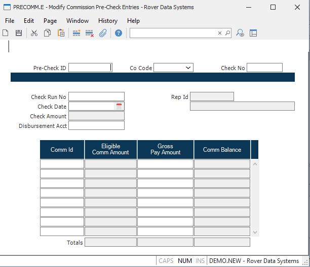

##  Modify Commission Pre-Check Entries (PRECOMM.E)

<PageHeader />

##

**Seq** Enter Prechecks ID/Sequence number to be edited. There are several lookups that can be performed from this field by check run number and vendor if you do not know the precheck id. You can, also, run [ PRECOMM.R1 ](../../../../../rover/AP-OVERVIEW/AP-REPORT/PRECOMM-R1) to obtain a listing of all existing precheck records.   
  
**Co Code** The company code for this precheck record. This field is for
reference only and cannot be changed. Any A/P items which are added to this
record must have a matching company code.  
  
**Check** Check # Assigned by system during [ CHECKS.F1 ](../../../../../rover/AP-OVERVIEW/AP-REPORT/CHECKS-F1) or [ CHECKS.F2 ](../../../../../rover/AP-OVERVIEW/AP-REPORT/CHECKS-F2) procedure. If required the check# can be changed usually due to a paper jam. However, once a check# has been issued AP Items cannot be added or deleted or modified.   
  
**Run** This field displays the check run number that this precheck record has been created for. The check run number is assigned when the [ COMM.P3 ](../../../../../rover/AP-OVERVIEW/AP-REPORT/CHECKS-F4/CHECKS-P3/COMM-P3) procedure is processed.   
  
**Check Date** Date that will print on check.  
  
**Check.Amt** Total amount of check to pay for this rep. This amount is the
total of the gross pay amount. It is displayed for reference only and cannot
be changed. NOTE: More than 1 check may have been issued to this rep.  
  
**Disb.Acct** Distribution Account check amounts will be posted to. This account is assigned when the precheck records are created in [ COMM.P3 ](../../../../../rover/AP-OVERVIEW/AP-REPORT/CHECKS-F4/CHECKS-P3/COMM-P3) but can be changed in this procedure if required.   
  
**Rep** This field displays the rep id for this precheck record. This field is
displayed for reference only and cannot be changed.  
  
**Rep Name** This field displays the name of the associate rep as it is defined in [ REP.E ](REP-E/README.md) .   
  
**COMM.ID** This field displays the commission ids that have been selected for
payment against this precheck record. You may delete a commission id by using
the F12 function key or change the gross pay amount. You can, also, add new
commission ids to this record providing they have not already been selected
for  
  
**Open Commission Amt** This field displays the eligible amount for payment
for the associated comm id. This field is displayed for reference only and
cannot be changed.  
  
**AP.Amounts** This fields displays the amount scheduled to be paid. This
amount can be changed to an amount that does not exceed the eligible
commission amount.  
  
**Inv-Balance** This field displays the balance that will be owed for this
commission id after the gross pay amount has been deducted from the eligible
commission amount. This field is displayed for reference only and cannot be
changed.  
  
**Total Eligible Amount** This field displays the total eligible commission
amount. It is displayed for reference only and cannot be changed.  
  
**Total Amount to Pay** This field contains the total gross amount to be paid.
The total discount amount is subtracted from this amount to calculate the
total check amount.  
  
**Total Open Balance** This field displays the total open balance. It is
displayed for reference only and cannot be changed.  
  
  
<badge text= "Version 8.10.57" vertical="middle" />

<PageFooter />