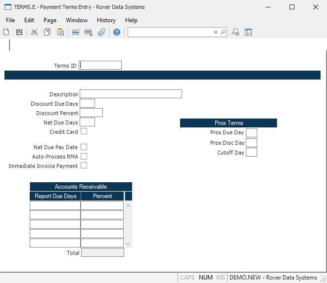

##  Payment Terms Entry (TERMS.E)

<PageHeader />

##

**Terms ID** Enter the identification of the terms code you wish to add or
update. You should establish a standard naming convention for the names which
can be understood by all users. For example, "NET30" could be used for the
terms Net 30.  
  
**Description** Enter a description of the terms being defined. This is the
information that will be printed on the purchase order form and other reports
that reference this terms code.  
  
**Discount Due Days** Enter the number of days in which payment must be made
to take the discount. For example, you would enter 10 in this field for the
terms 2% 10 Net 30.  
  
**Discount Percent** Enter the percentage discount which may be taken if paid
early. For example, you would enter the number 2 in this field for 2% 10 Net
30.  
  
**Net Due Days** Enter the net due days in which payment must be made. For
example, you would enter the number 30 for the terms 2% 10 Net 30.  
  
**Credit Card** Check this box if the terms code identifies a credit card
payment method. Sales orders that use a credit card terms code will require a
credit card to be processed at sales order entry and/or when the order is
shipped.  
  
**Due Day** If this terms record is to be used as a "prox" or "th" (e.g. net
10th), then enter the date on which the due date is to be established. For
example, for Net 10th terms, "10" would be place into this field and each due
date would be the 10th day of the month.  
  
**Cutoff Day** If the previous field contained a due day, then this field can
be used to control into which month the due date will fall. For example, for
terms of Net 10th with a cutoff day of 25, all invoices dated prior to the
25th will be assigned a due date of the 10th of next month. Any invoice with a
date after the 25th of the month will be assigned the 10th two months out.  
  
**Net Due Days** Enter the net due days you wish to be used when running accounts receivable reports such as the aging report, [ AR.R3 ](AR-R3/README.md) , by due date. If this field is empty then the net due days will be used. All other reports and queries will use the net due days as well.   
  
**Net Due PCT** Enter the percent you wish to be used when using the report
due days.  
  
**Total Percent** The total percent for all net due days. This field is
calculated by the sysem and cannot be  
updated. It must equal 100% or the record cannot be saved.  
  
  
<badge text= "Version 8.10.57" vertical="middle" />

<PageFooter />