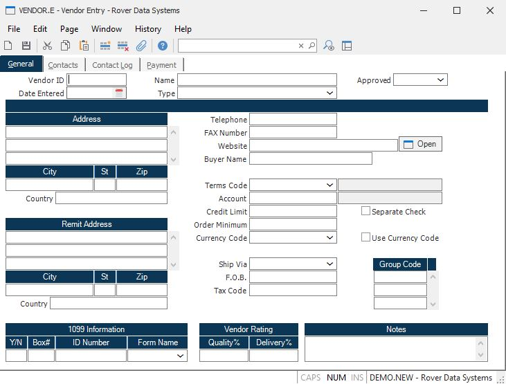

##  Vendor Entry (VENDOR.E)

<PageHeader />

##  General

**Vendor ID** Enter the number which identifies the vendor you wish to add or
change. If you wish to have the system assign the next sequential number,
leave this field null. If you want to access an existing vendor record but do
not know the vendor's number, there is an option in the help menu for this
prompt which allows you to select a vendor by entering the vendor's name.  
  
**Date Entered** This is the date the vendor was entered. It will default to
the system date for new vendors.  
  
**Name** Enter the name of the vendor described in this record.  
  
**Type** Select the type that best defines this vendor.  
  
**Approved** If this is an approved vendor, enter 'Y' in this field.  
  
**Address** Enter the street address for this vendor. Do not include the city,
state, or zip. Enter those in the adjacent separate fields. The street, city,
state, zip, and country will be combined for printing purposes.  
  
**City** Enter the city portion of the address information.  
  
**State** Enter the state portion of the address information.  
  
**Zip** Enter the zip code portion of the address information.  
  
**Country** Enter the country portion of the address information.  
  
**Remit Addr** Enter the street address to use when making payments to this
vendor. If this address is the same as the vendor's primary address then leave
this field blank. You may enter up to 4 lines of text.  
  
**Remit City** Enter the remit-to city that is to be printed on the check for
this vendor.  
  
**Remit State** Enter the remit-to state to be printed on the check for this
vendor.  
  
**Remit Zip** Enter the remit-to zip code to be printed on the check for this
vendor.  
  
**Remit Country** Enter the remit-to country to be printed on the check for
this vendor.  
  
**1099.Flag** If this vendor requires 1099 reporting, enter a "Y", otherwise
enter either an "N" or leave null.  
  
**1099 Box** Enter the box on the 1099 form which is to used to print forms for this vendor. This field will be used as a default into the [ AP.E ](../../../../../rover/AP-OVERVIEW/AP-ENTRY/AP-E) procedure. If this field is left empty the non-employee compensation box is assumed.   
  
**ID.Number** Enter the vendor's payer ID number. This may be a social
security number in the case of a sole proprietor or individual, or a federal
tax ID.  
  
**Quality Weight%** Enter the percentage to be applied to quality performance when rating the overall performance of the vendor. For example, you may want to place a higher percentage on delivery for distributors since they are not directly responsible for quality issues. A vendor that manufactures the items it delivers might need more emphasis placed on the quality factor in the rating. If no entry is made in this field, the qualtity percentage entered in [ DMR.CONTROL ](DMR-CONTROL/README.md) will be used.   
  
**Delivery Weight%** Enter the percentage to be applied to delivery performance when rating the overall performance of the vendor. For example, you may want to place a higher percentage on delivery for distributors since they are not directly responsible for quality issues. A vendor that manufactures the items it delivers might need more emphasis placed on the quality factor in the rating. If no entry is made in this field, the delivery percentage entered in [ DMR.CONTROL ](DMR-CONTROL/README.md) will be used.   
  
**Telephone** Enter the telephone number for this vendor. The suggested format
is XXX/XXX-XXXX.  
  
**FAX Number** Enter the number to use for sending a fax to this vendor. The
suggested format is XXX/XXX-XXX.  
  
**Website** Enter the URL for the vendor's website.  
  
**Buyer Name** Enter the name of the buyer who normally deals with this
vendor. There is a help lookup to display buyers.  
  
**Terms** Enter the terms code which defines the method of payment normally
used by this vendor. The terms code must have been previously entered in the
terms file.  
  
**Terms Desc** Contains the description of the terms in the previous field.
This information is loaded from the TERMS file for reference only and may not
be changed.  
  
**Account** Enter the General Ledger account number assigned to this vendor. A valid account number entered here will default into the [ PO.E ](PO-E/README.md) and [ AP.E ](../../../../../rover/AP-OVERVIEW/AP-ENTRY/AP-E) screens.   
  
**Account Desc** This field contains the description of the GL chart of
account.  
  
**Credit Limit** Enter the credit limit your company has with this vendor.  
  
**Sep Check** Check this box to default each AP item to be paid on a separate
check, rather than grouping it with other AP items for the same vendor.  
  
**Order Minimum** If applicable, enter the minimum amount a purchase order can be taken for this vendor. If a purchase requisition is entered in [ POREQ.E ](POREQ-E/README.md) or a purchase order is entered in [ PO.E ](PO-E/README.md) for an amount that is less than this amount, a warning message will be issued.   
  
**Currency Code** If applicable, enter the currency code for this vendor.  
  
**Use Currency** If this box is checked, the currency code entered on this
screen will be loaded into new purchase orders and AP records. If this box is
checked and no currency code is entered, the check mark will be removed when
the record is saved.  
  
**Ship Via** Enter the method of shipment normally used with this vendor. You
would normally enter the name of a carrier or preferred method of shipment.  
  
**F.O.B.** Enter the F.O.B. point normally used by this vendor.  
  
**Tax Code** Enter the tax code for this vendor. This will be defaulted into
the purchase orders placed with this vendor and sales tax will be calculated
and added to the AP records based on this tax code rate from the PTAX file.  
  
**EPayment ID** If you are using an electronic payment capability, this is the
vendor's unique identifier for the service provider. For the Paymode-X service
provider it is also called "12.12".  
  
**Notes** Enter any notes applicable to this vendor.  
  
**Open** Click here to open this website.  
  
  
<badge text= "Version 8.10.57" vertical="middle" />

<PageFooter />