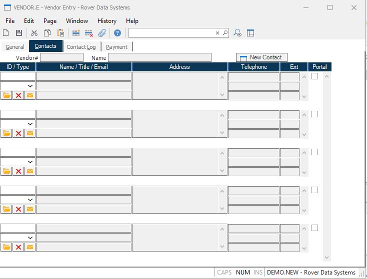

##  Vendor Entry (VENDOR.E)

<PageHeader />

##  Contacts

**Vendor#** The number that identifies the vendor.  
  
**Name** The name of the vendor.  
  
**Contact ID** Displays the IDs of all the contacts associated with the
vendor. To add an existing contact to the list you may enter the contact ID or
a word or portion of a word from the contact name to display a list of
possible entries to select from. If the contact is not already on file you may
create it by clicking the "New Contact" button.  
  
**Contact Type** Enter the type code to be associated with the contact. The list of options available is defined in the [ CONTACT.CONTROL ](../../../../../rover/AP-OVERVIEW/AP-ENTRY/CONTACT-CONTROL) procedure.   
  
**Contact Name** Displays the name of each contact.  
  
**Contact Title** Displays the job title for each contact.  
  
**Contact Email** Displays the email address for each contact. The right click
menu contains an option to send an email to the address.  
  
**Contact Address** Displays the address for each contact.  
  
**Contact Telephone** Displays the telephone numbers for each contact.  
  
**Contact Extension** Displays the extensions, if any, associated with each
telephon number.  
  
**** Click this button to edit the information for the associated contact.  
  
**** Click this button to remove the contact from the vendor.  
  
**** Click this button to send an email to the contact.  
  
**New Contact** Click this button to create a new contact. This will launch the contact entry procedure ( [ CONTACT.E ](CONTACT-E/README.md) ) and add the ID of the new contact to the list of existing contacts for the vendor. If a contact record already exists and you simply want to add it to the list enter contact id in the first open contact id field or enter a portion of the name to invoke a lookup.   
  
  
<badge text= "Version 8.10.57" vertical="middle" />

<PageFooter />