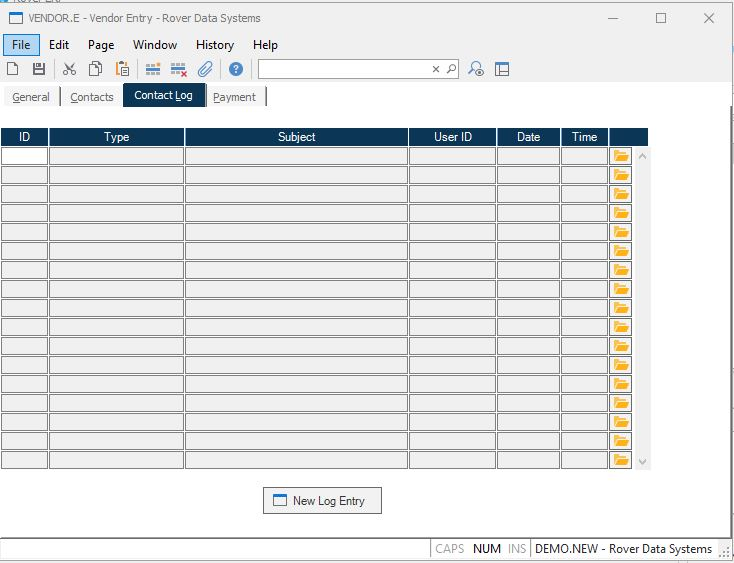

##  Vendor Entry (VENDOR.E)

<PageHeader />

##  Contact Log

**Log ID** Displays the id of each associated log entry.  
  
**Log Type** Displays the type assigned to the associated log record.  
  
**Log Subject** Displays the subject of the associted log record.  
  
**Log User ID** Displays the log in Id of the user that created the associated
log record.  
  
**Log Date** Displays the date on whcih the associated log was created.  
  
**Log Time** Displays the time at which the associated log record was created.  
  
**** Click this button to open the associated log record.  
  
**New Log Entry** Click this button to create a new entry to the log file.  
  
  
<badge text= "Version 8.10.57" vertical="middle" />

<PageFooter />