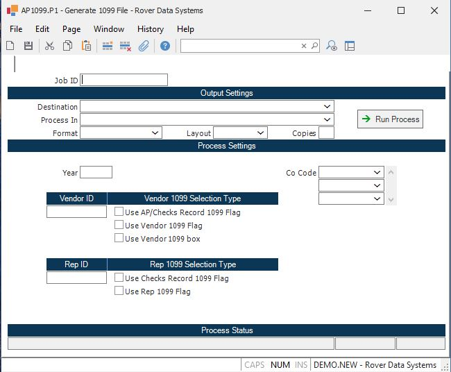

##  Generate 1099 File (AP1099.P1)

<PageHeader />

##

**Job ID** Enter a unique ID if you wish to enter and save the parameters to
this procedure for future use. If you only need to run the procedure and do
not want to save your entry then you may leave this field empty.  
  
**Destination** Select the destination for the output from this procedure.  
  
**Process** Select the method to be used for processing the report. Foreground
is always available and must be used when output is directed to anything other
than a system printer (i.e. printers spooled through the database on the host
computer.) Depending on your setup there may be various batch process queues
available in the list that allow you to submit the job for processing in the
background or at a predefined time such as overnight. A system printer must be
specified when using these queues.  
  
**Format** Select the format for the output. The availability of other formats
depends on what is allowed by each procedure. Possible formats include Text,
Excel, Word, PDF, HTML, Comma delimited and Tab delimited.  
  
**Layout** You may indicate the layout of the printed page by specifying the
appropriate setting in this field. Set the value to Portrait if the page is to
be oriented with the shorter dimension (usually 8.5 inches) at the top or
Landscape if the longer dimension (usually 11 inches) is to be at the top.
Portrait will always be available but Landscape is dependent on the output
destination and may not be available in all cases.  
  
**Copies** Enter the number of copies to be printed.  
  
**Run Process** Click on the button to run the process. This performs the save
function which may also be activated by clicking the save button in the tool
bar or pressing the F9 key or Ctrl+S.  
  
**Start Date** Enter the year for which you want to generate the 1099 file.
This must be entered as a four digit year.  
  
**Vendor** If you want generate/regenerate the 1099 file for a specific
vendor, enter that vendor number here. If you leave this field null, all
vendors with a 1099 payment within the period will be added to the 1099 file.
Leave both vendor and rep null to generate the whole 1099 file.  
  
**Vendor Select 1** If you wish to use the 1099 flag which is present in the
AP or Checks records check here.  
  
**Vendor Select 2** Check here to use the 1099 flag in the Vendor file,
thereby selecting all AP items and miscelleneous checks for vendors flagged
for 1099.  
  
**Use Vendor 1099 Box** Check this box if you wish the box number posted to the VENDOR record via [ VENDOR.E ](../../../../../../rover/AP-OVERVIEW/AP-ENTRY/VENDOR-E) to print on the 1099 form instead of the box number posted to the A/P record. If this box is not checked the box number that has been entered into [ AP.E ](../../../../../../rover/AP-OVERVIEW/AP-ENTRY/AP-E) will be used in this procedure regardless if the 1099 is to be generated from the A/P or VENDOR file.   
  
**Rep** f you want generate/regenerate the 1099 file for a specific rep, enter
that rep number here. If you leave this field null, all reps with a 1099
payment within the period will be added to the 1099 file. Leave both vendor
and rep null to generate the whole 1099 file.  
  
**Rep Select 1** If you wish to use the 1099 flag which is present in the
Checks records check here.  
  
**Rep Select 2** Check here to use the 1099 flag in the rep file, thereby
selecting all commission and miscelleneous checks for reps flagged for 1099.  
  
**Code** If you want to generate the 1099 file for a specific company code,
enter that code(s) here.  
  
**Last Status Message** Contains the last status message generated by the
program.  
  
**Last Status Date** The date on which the last status message was generated.  
  
**Last Status Time** The time at which the last status message was generated.  
  
  
<badge text= "Version 8.10.57" vertical="middle" />

<PageFooter />