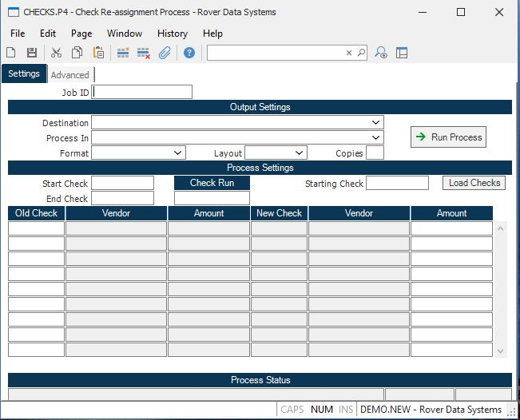

##  Check Re-assignment Process (CHECKS.P4)

<PageHeader />

##

**Job ID** Enter a unique ID if you wish to enter and save the parameters to
this procedure for future use. If you only need to run the procedure and do
not want to save your entry then you may leave this field empty.  
  
**Destination** Select the destination for the output from this procedure.  
  
**Process** Select the method to be used for processing the report. Foreground
is always available and must be used when output is directed to anything other
than a system printer (i.e. printers spooled through the database on the host
computer.) Depending on your setup there may be various batch process queues
available in the list that allow you to submit the job for processing in the
background or at a predefined time such as overnight. A system printer must be
specified when using these queues.  
  
**Format** Select the format for the output. The availability of other formats
depends on what is allowed by each procedure. Possible formats include Text,
Excel, Word, PDF, HTML, Comma delimited and Tab delimited.  
  
**Layout** You may indicate the layout of the printed page by specifying the
appropriate setting in this field. Set the value to Portrait if the page is to
be oriented with the shorter dimension (usually 8.5 inches) at the top or
Landscape if the longer dimension (usually 11 inches) is to be at the top.
Portrait will always be available but Landscape is dependent on the output
destination and may not be available in all cases.  
  
**Copies** Enter the number of copies to be printed.  
  
**Run Process** Click on the button to run the process. This performs the save
function which may also be activated by clicking the save button in the tool
bar or pressing the F9 key or Ctrl+S.  
  
**Start Check** If you do not wish to re-assign the check numbers for all
checks in the check run, enter the starting check number in this field.  
  
**End Check** If you do not wish to re-assign the check numbers for all checks
in the check run, enter the ending check number in this field.  
  
**Check Run** Enter the check run number in this field. After entry of the run
number, the checks will be loaded into the screen for you.  
  
**Starting Check** Enter the starting check number that should be used when
assigning the new check numbers that will replace the existing check number.
This number will be incremented by one for each existing check.  
  
**Load Checks** Press this button when you are ready to load in the new check
numbers.  
  
**Existing Check Number** Enter the check number you wish to update/re-assign
with a new check id. When this record is saved and/or processed, this check
will be deleted from the checks file and will be replaced by the new check
number.  
  
**Vendor Name** The name of the vendor for the associated check number.  
  
**Check Amount** The amount of the associated check.  
  
**New Check** The new check number will be displayed in this field for you.
This is the check that will replace the old check number. The last check in
this list should not exist in the checks file. If it does you will not be able
to proces this record.  
  
**New Vendor** If the new check number already exists in the system, the
vendor name will be displayed in this field for you.  
  
**New Check Amount** If the new check number already exists in the system, the
check amount will be displayed in this field for you.  
  
**Last Status Message** Contains the last status message generated by the
program.  
  
**Last Status Date** The date on which the last status message was generated.  
  
**Last Status Time** The time at which the last status message was generated.  
  
  
<badge text= "Version 8.10.57" vertical="middle" />

<PageFooter />