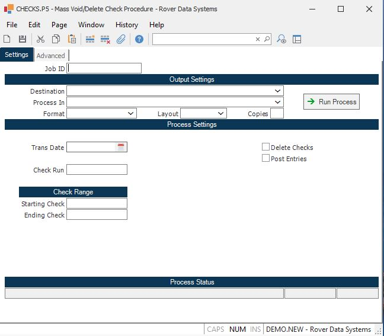

##  Mass Void/Delete Check Procedure (CHECKS.P5)

<PageHeader />

##

**Job ID** Enter a unique ID if you wish to enter and save the parameters to
this procedure for future use. If you only need to run the procedure and do
not want to save your entry then you may leave this field empty.  
  
**Destination** Select the destination for the output from this procedure.  
  
**Process** Select the method to be used for processing the report. Foreground
is always available and must be used when output is directed to anything other
than a system printer (i.e. printers spooled through the database on the host
computer.) Depending on your setup there may be various batch process queues
available in the list that allow you to submit the job for processing in the
background or at a predefined time such as overnight. A system printer must be
specified when using these queues.  
  
**Format** Select the format for the output. The availability of other formats
depends on what is allowed by each procedure. Possible formats include Text,
Excel, Word, PDF, HTML, Comma delimited and Tab delimited.  
  
**Layout** You may indicate the layout of the printed page by specifying the
appropriate setting in this field. Set the value to Portrait if the page is to
be oriented with the shorter dimension (usually 8.5 inches) at the top or
Landscape if the longer dimension (usually 11 inches) is to be at the top.
Portrait will always be available but Landscape is dependent on the output
destination and may not be available in all cases.  
  
**Copies** Enter the number of copies to be printed.  
  
**Run Process** Click on the button to run the process. This performs the save
function which may also be activated by clicking the save button in the tool
bar or pressing the F9 key or Ctrl+S.  
  
**Last Status Message** Contains the last status message generated by the
program.  
  
**Last Status Date** The date on which the last status message was generated.  
  
**Last Status Time** The time at which the last status message was generated.  
  
**Void Date** Enter the date that should be used to void or delete the check.
This is the date that will be posted to the accounts payable register file and
ultimately the general ledger. If the date on the check is greater than this
date, the check will not be voided or deleted.  
  
**Check Run** If you wish to void or delete checks for a specific check run,
enter the run number in this field. When using this option, it is not required
to enter a starting and ending check number. Checks that have been cleared or
previously voided will not be selected.  
  
**Starting Check** If you wish to delete or void checks based on a range of
check numbers, enter the starting check number in this field. When using this
optoin, both a starting and ending number are required. An entry is not
required in the check run field when using this option. Checks that have been
cleared or previously voided will not be selected.  
  
**Ending Check** If you wish to delete or void checks based on a range of
check numbers, enter the ending check number in this field. When using this
optoin, both a starting and ending number are required. An entry is not
required in the check run field when using this option. Checks that have been
cleared or previously voided will not be selected.  
  
**Delete Checks** Check this box, if you wish to delete the checks. If this
box is not checked, the checks will be voided.  
  
**Post Entries** If this box is not checked, the process will be run in TEST
mode so that you can see which checks can be voided/deleted and which cannot
be. When you are ready to post the entries, check this box. It is recommended
that this process always be run in TEST mode before posting.  
  
  
<badge text= "Version 8.10.57" vertical="middle" />

<PageFooter />