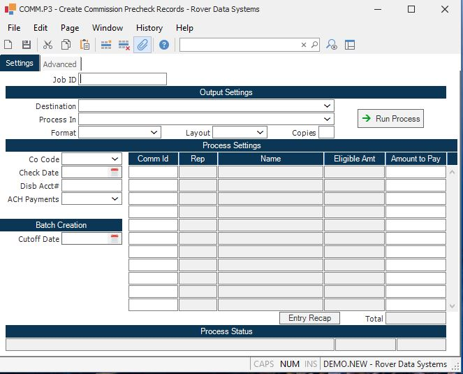

##  Create Commission Precheck Records (COMM.P3)

<PageHeader />

##

**Job ID** Enter a unique ID if you wish to enter and save the parameters to
this procedure for future use. If you only need to run the procedure and do
not want to save your entry then you may leave this field empty.  
  
**Destination** Select the destination for the output from this procedure.  
  
**Process** Select the method to be used for processing the report. Foreground
is always available and must be used when output is directed to anything other
than a system printer (i.e. printers spooled through the database on the host
computer.) Depending on your setup there may be various batch process queues
available in the list that allow you to submit the job for processing in the
background or at a predefined time such as overnight. A system printer must be
specified when using these queues.  
  
**Format** Select the format for the output. The availability of other formats
depends on what is allowed by each procedure. Possible formats include Text,
Excel, Word, PDF, HTML, Comma delimited and Tab delimited.  
  
**Layout** You may indicate the layout of the printed page by specifying the
appropriate setting in this field. Set the value to Portrait if the page is to
be oriented with the shorter dimension (usually 8.5 inches) at the top or
Landscape if the longer dimension (usually 11 inches) is to be at the top.
Portrait will always be available but Landscape is dependent on the output
destination and may not be available in all cases.  
  
**Copies** Enter the number of copies to be printed.  
  
**Run Process** Click on the button to run the process. This performs the save
function which may also be activated by clicking the save button in the tool
bar or pressing the F9 key or Ctrl+S.  
  
**Co Code** Enter the company code you wish to create checks for. If only one
company code exists it will automatically be inserted into this procedure for
you.  
  
**Check Date** Enter the date to be used as the check date. This can differ
from both the cutoff date and the current date as needed.  
  
**Disb.Acct#** Enter the cash disbursement G/L account number which will be used for this check run. This entry is defaulted from the [ AP.CONTROL ](../../../AP-ENTRY/AP-CONTROL/README.md) file but can be changed as required. If no entry is made in this field, the account entered in the [ AP.CONTROL ](../../../AP-ENTRY/AP-CONTROL/README.md) record will be used.   
  
**Cutoff Date** Enter the date which will be used to determine which
commission records and amounts are eligable to be paid. This field is only
used for batch selection. If you are going to directly enter commission items,
this field is left blank.  
  
**Comm.Id** If you wish to select individual commission items for payment,
enter the commission numbers here. If you wish to select all items eligible
for payment by a selected date, leave this field null and use the Cutoff Date.
You may also use the help key to load all eligable commissions for a rep.  
  
**Rep** The number of the rep for which the commission is being paid.  
  
**Rep Name** The name of the rep which is being paid.  
  
**Eligible Amount** This field contains the eligible amount that can be paid
against the associated comm record.  
  
**Amt to Pay** This field contains that amount to pay for the associated comm
id. This amount will initially be set to the eligible amount but can be
changed as required. It cannot, however, be changed to an amount that exceeds
the eligible amount.  
  
**Total** This field is the total of all items selected when they have been
manually entered.  
  
**Last Status Message** Contains the last status message generated by the
program.  
  
**Last Status Date** The date on which the last status message was generated.  
  
**Last Status Time** The time at which the last status message was generated.  
  
**Entry Recap** Pressing this button will display the total amount entered for
each rep.  
  
  
<badge text= "Version 8.10.57" vertical="middle" />

<PageFooter />