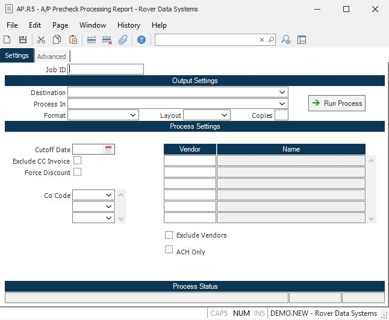

##  A/P Precheck Processing Report (AP.R5)

<PageHeader />

##

**Job ID** Enter a unique ID if you wish to enter and save the parameters to
this procedure for future use. If you only need to run the procedure and do
not want to save your entry then you may leave this field empty.  
  
**Destination** Select the destination for the output from this procedure.  
  
**Process** Select the method to be used for processing the report. Foreground
is always available and must be used when output is directed to anything other
than a system printer (i.e. printers spooled through the database on the host
computer.) Depending on your setup there may be various batch process queues
available in the list that allow you to submit the job for processing in the
background or at a predefined time such as overnight. A system printer must be
specified when using these queues.  
  
**Format** Select the format for the output. The availability of other formats
depends on what is allowed by each procedure. Possible formats include Text,
Excel, Word, PDF, HTML, Comma delimited and Tab delimited.  
  
**Layout** You may indicate the layout of the printed page by specifying the
appropriate setting in this field. Set the value to Portrait if the page is to
be oriented with the shorter dimension (usually 8.5 inches) at the top or
Landscape if the longer dimension (usually 11 inches) is to be at the top.
Portrait will always be available but Landscape is dependent on the output
destination and may not be available in all cases.  
  
**Copies** Enter the number of copies to be printed.  
  
**Run Process** Click on the button to run the process. This performs the save
function which may also be activated by clicking the save button in the tool
bar or pressing the F9 key or Ctrl+S.  
  
**Cutoff Date** Enter the date to be used as the cutoff date for this report.
Any invoices with dates to pay after this date will not be included.  
  
**Exclude CC Invoices** Check this box if you wish to exclude invoices that are scheduled to be paid by credit card from the report. Please note that the system uses the terms code to determine if the invoice is scheduled to be paid by credit card. You would use the [ TERMS.E ](../../../../../rover/AP-OVERVIEW/AP-ENTRY/TERMS-E) procedure to flag a terms code as a credit card type term. If you do not have access to this procedure, please contact your administrator.   
  
**Force Discount** Check this box if you wish to take a discount on all items,
regardless as to the date. Do not check this box if you wish to use the
standard date calculations to determine if the discount should be allowed.  
  
**Co Code** Enter the company codes you wish to appear on this report. If left
blank all company codes will be included.  
  
**Vendor** If you wish to run this report for selected vendors, enter the
vendor id(s) in this field. If you wish to exclude these vendors from the
report, you must, also, select the EXCLUDE VENDORS option.  
  
**Vendor Name** The name of the associated vendor.  
  
**Exclude Vendors** Check this box if you wish to exclude the above vendors
from the report.  
  
**Last Status Message** Contains the last status message generated by the
program.  
  
**Last Status Date** The date on which the last status message was generated.  
  
**Last Status Time** The time at which the last status message was generated.  
  
  
<badge text= "Version 8.10.57" vertical="middle" />

<PageFooter />