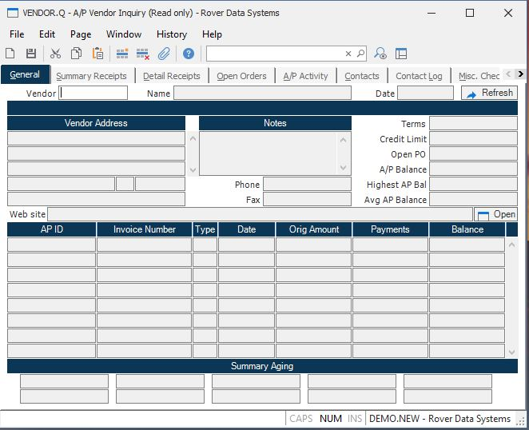

##  A/P Vendor Inquiry (VENDOR.Q)

<PageHeader />

##  General

**Vendor Number** Enter the number of the vendor against which you would like
to inquire. The help menu contains an option which allows you to select a
vendor by entering the vendor's name.  
  
**Name** The name of the vendor.  
  
**Date Entered** The date the vendor was added.  
  
**Vendor Address** The street address of the vendor.  
  
**City** The city of the vendor.  
  
**State** The state of the vendor.  
  
**Zip** The zip code of the vendor.  
  
**Country** The country of the vendor.  
  
**Notes** Notes associated with the vendor.  
  
**Telephone** The telephone number of the vendor.  
  
**Fax Number** The Fax number of the vendor.  
  
**Terms Code** The terms code normally used for this vendor.  
  
**Credit Limit** The credit limit your company has with this vendor.  
  
**Open Orders** The total dollar amount of open purchase orders currently on
file for this vendor.  
  
**A/P Balance** The total A/P balance for this vendor.  
  
**Highest AP Balance** This is the highest AP balance for the time period specified in [ ACCT.CONTROL ](../../../../../rover/AP-OVERVIEW/AP-ENTRY/ACCT-CONTROL) .   
  
**Avg AP Balance** This is the average AP daily balance for the time period specified in [ ACCT.CONTROL ](../../../../../rover/AP-OVERVIEW/AP-ENTRY/ACCT-CONTROL) , excluding zero balances.   
  
**AP.Id** The list of open AP items for this vendor.  
  
**Type** The type of AP item:  
I = Invoice  
D = Debit Memo  
P =  
  
**Date** This field contains either the invoice (debit) date or the due date, depending upon the setting of the Aging Method in [ AP.CONTROL ](../../../../../rover/AP-OVERVIEW/AP-ENTRY/AP-E/CHECKS-E/AP-CONTROL) . If the due date is used, is it calculated based upon the discount days, or the net due days if discount days are not present.   
  
**Orig.Amount** The original amount of the AP item.  
  
**Payment.Amt** The total amount of payment applied to this AP item.  
  
**Balance** The balance due on this AP item.  
  
**Invoice Number** The vendor's invoice number.  
  
**Aging Column 1** The title for aging column 1 from [ AP.CONTROL ](../../../../../rover/AP-OVERVIEW/AP-ENTRY/AP-E/CHECKS-E/AP-CONTROL) .   
  
**Aging Column 2** The title for aging column 2 from [ AP.CONTROL ](../../../../../rover/AP-OVERVIEW/AP-ENTRY/AP-E/CHECKS-E/AP-CONTROL) .   
  
**Aging Column 3** The title for aging column 3 from [ AP.CONTROL ](../../../../../rover/AP-OVERVIEW/AP-ENTRY/AP-E/CHECKS-E/AP-CONTROL) .   
  
**Aging Column 4** The title for aging column 4 from [ AP.CONTROL ](../../../../../rover/AP-OVERVIEW/AP-ENTRY/AP-E/CHECKS-E/AP-CONTROL) .   
  
**Aged Amount 1** The amount of the vendor's current AP balance which falls
into the first aging 'bucket'.  
  
**Aged Amount 2** The amount of the vendor's current AP balance which falls
into the second aging 'bucket'.  
  
**Aged Amount 3** The amount of the vendor's current AP balance which falls
into the third aging 'bucket'.  
  
**Aged Amount 4** The amount of the vendor's current AP balance which falls
into the fourth aging 'bucket'.  
  
**Refresh** Click this button to display the most recent information for the
vendor from the database.  
  
**Aging Column 5** The title for aging column 5 from [ AP.CONTROL ](../../../../../rover/AP-OVERVIEW/AP-ENTRY/AP-E/CHECKS-E/AP-CONTROL) .   
  
**Aged Amount 5** The amount of the vendor's current AP balance which falls
into the fifth aging 'bucket'.  
  
  
<badge text= "Version 8.10.57" vertical="middle" />

<PageFooter />