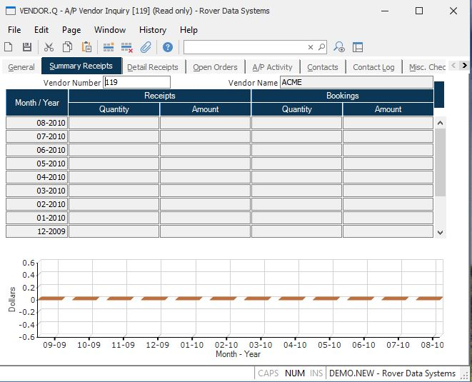

##  A/P Vendor Inquiry (VENDOR.Q)

<PageHeader />

##  Summary Receipts

**Vendor Number** The number identifying the vendor currently being viewed.  
  
**Vendor Name** The name of the vendor currently being viewed.  
  
**MOYR** Displays the period (month-year) for the associated information.  
  
**Receipt Quantity** The number of items received from the vendor during the
associated month and year.  
  
**Receipt Amount** The dollar amount received from the vendor during the
associated month.  
  
**Booking Quantity** The quantity of items order from the vendor during the
associated month.  
  
**Booking Amount** The dollar amount ordered from the vendor in the associated
month.  
  
**Receipts Chart** Displays the dollar value of the historical receipts from
the vendor.  
  
  
<badge text= "Version 8.10.57" vertical="middle" />

<PageFooter />