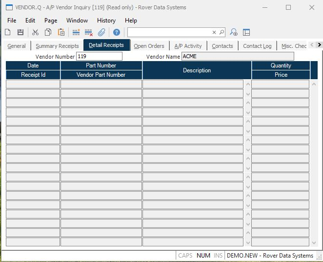

##  A/P Vendor Inquiry (VENDOR.Q)

<PageHeader />

##  Detail Receipts

**Vendor Number** The number identifying the vendor currently being viewed.  
  
**Vendor Name** The name of the vendor currently being viewed.  
  
**Date Received** The date on which the receipt was made.  
  
**Receipt Id** The identification number assigned to the receipt. The receipt
id is the purchase order number followed by a dash (-) and a sequential number
indicating which receipt it was against the purchase order. For example, 123-1
is the first receipt posted against purchase order 123.  
  
**Part Number** The part number as it appears on the receipt.  
  
**Description** The part description as it appears on the receipt.  
  
**Quantity** The receipt quantity.  
  
**Unit Price** The unit price used on this receipt.  
  
**Description of Vendor Part Number** The vendor's part number(s) posted to
the receipt record for this line item.  
  
  
<badge text= "Version 8.10.57" vertical="middle" />

<PageFooter />