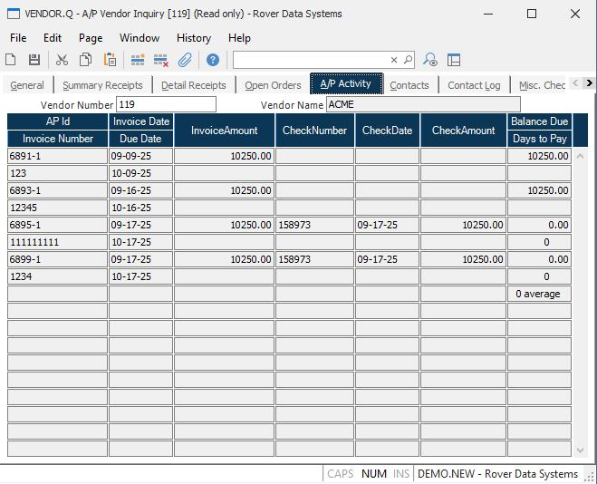

##  A/P Vendor Inquiry (VENDOR.Q)

<PageHeader />

##  A/P Activity

**Vendor Number** The number identifying the vendor currently being viewed.  
  
**Vendor Name** The name of the vendor currently being viewed.  
  
**AP.ID** The list of AP items for this vendor.  
  
**Inv-Date** The invoice date on the associated item.  
  
**Invoice Amount** The invoice amount for the associated item.  
  
**Check Number** The check number issued to pay the associated invoice.  
  
**Check-Date** The date the check was issued on.  
  
**Check Amount** The amount that was paid against the referenced check for
this invoice.  
  
**Balance Due** The open amount for this invoice.  
  
  
<badge text= "Version 8.10.57" vertical="middle" />

<PageFooter />