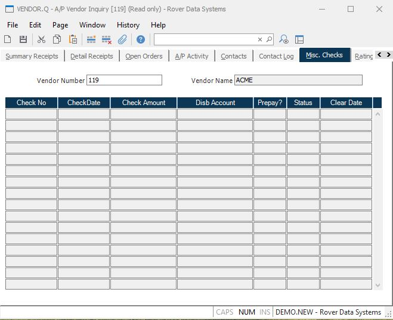

##  A/P Vendor Inquiry (VENDOR.Q)

<PageHeader />

##  Misc. Checks

**Vendor Number (Misc Checks)** The vendor number.  
  
**Vendor Name (Misc Checks)** The vendor name.  
  
**Check Number (Misc Checks)** The miscellaneous check number issued to this
vendor.  
  
**Check Date** The date the check was issued.  
  
**Check Amount (Misc Checks)** The amount the check was issued for.  
  
**Disbursement Account (Misc Checks)** The disbursement account the check was
issued against.  
  
**Prepay? (Misc Checks)** A "Y" will appear in this field if the check was
issued as a prepay item.  
  
**Status** The status of the referenced check: P = posted, C = Cleared,  
S = stop payment, V = void.  
  
**Clear-Date (Misc Checks)** The date the check was cleared.  
  
  
<badge text= "Version 8.10.57" vertical="middle" />

<PageFooter />