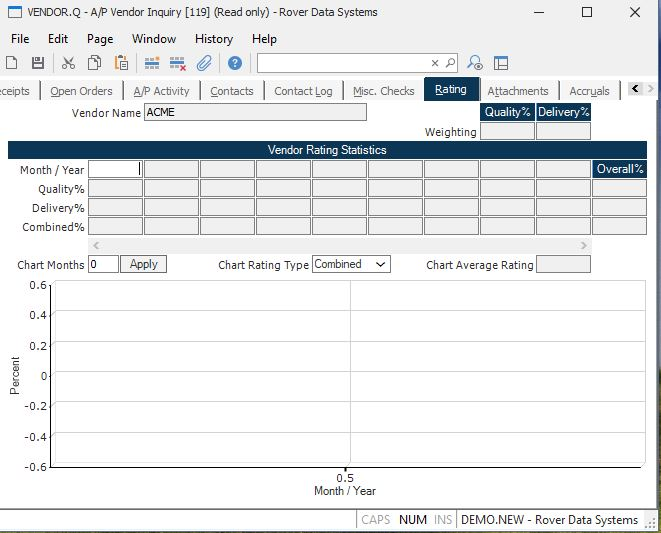

##  A/P Vendor Inquiry (VENDOR.Q)

<PageHeader />

##  Rating

**Vendor Name** The name of the vendor.  
  
**MonthYear** Displays the period (month-year) for the associated information.  
  
**Quality Rating** This is the quality rating for the associated month. If it is blank, then there were no receipts during the month. It is calculated using factors set in the [ DMR.CONTROL ](DMR-CONTROL/README.md) record.   
  
**Delivery Rating** This is the delivery rating for the associated month. If it is blank, then there were no receipts during the month. It is calculated using factors set in the [ DMR.CONTROL ](DMR-CONTROL/README.md) record.   
  
**Combined Rating** This is the combination of quality and delivery ratings
wieghted by the factors above, for the associated month. If it is blank, then
there were no receipts during the month.  
  
**Quality Weighting** This is the weighting factor for quality. It is defaulted from the entry on the vendor record, and if the vendor record has no entry, it is from the [ DMR.CONTROL ](DMR-CONTROL/README.md) record.   
  
**Delivery Weighting** This is the weighting factor for delivery. It is defaulted from the entry on the vendor record, and if the vendor record has no entry, it is from the [ DMR.CONTROL ](DMR-CONTROL/README.md) record.   
  
**Chart Months** The field controls the number of months that are displayed in the rating chart. The number of months initially loaded into this field for you is 12 unless there have been fewer than 12 months of rating for the vendor. Please note that the the total number of months the system will track rating for any vendor is defined in [ DMR.CONTROL ](DMR-CONTROL/README.md) . Therefore, a number should not be entered that is greater than the number entered in [ DMR.CONTROL ](DMR-CONTROL/README.md) .   
  
**Apply**  
  
**Chart Type** The field controls the rating element that is displayed in the
rating chart. The combined rating is initially loaded into this field and
displayed on the chart.  
  
**Chart Combined** Displays the average rating for the periods being displayed
in the chart.  
  
**Rating Chart** Displays a chart of the historical rating statistics. You may
right click this chart to display it in its own window where it can be resized
for better viewing if required.  
  
**Overall Quality** This is the overall quality rating for all periods with
receipts.  
  
**Overall Delivery** This is the overall delivery rating for all periods with
receipts.  
  
**Overall Combined** This is the overall combined rating for all periods with
receipts.  
  
  
<badge text= "Version 8.10.57" vertical="middle" />

<PageFooter />