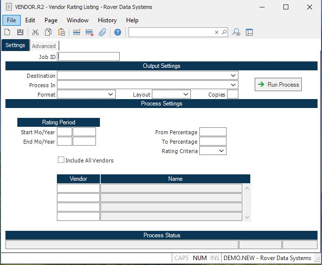

##  Vendor Rating Listing (VENDOR.R2)

<PageHeader />

##

**Job ID** Enter a unique ID if you wish to enter and save the parameters to
this procedure for future use. If you only need to run the procedure and do
not want to save your entry then you may leave this field empty.  
  
**Destination** Select the destination for the output from this procedure.  
  
**Process** Select the method to be used for processing the report. Foreground
is always available and must be used when output is directed to anything other
than a system printer (i.e. printers spooled through the database on the host
computer.) Depending on your setup there may be various batch process queues
available in the list that allow you to submit the job for processing in the
background or at a predefined time such as overnight. A system printer must be
specified when using these queues.  
  
**Format** Select the format for the output. The availability of other formats
depends on what is allowed by each procedure. Possible formats include Text,
Excel, Word, PDF, HTML, Comma delimited and Tab delimited.  
  
**Layout** You may indicate the layout of the printed page by specifying the
appropriate setting in this field. Set the value to Portrait if the page is to
be oriented with the shorter dimension (usually 8.5 inches) at the top or
Landscape if the longer dimension (usually 11 inches) is to be at the top.
Portrait will always be available but Landscape is dependent on the output
destination and may not be available in all cases.  
  
**Copies** Enter the number of copies to be printed.  
  
**Run Process** Click on the button to run the process. This performs the save
function which may also be activated by clicking the save button in the tool
bar or pressing the F9 key or Ctrl+S.  
  
**Start Month** Enter the starting month number for which you want to summarize and print the statistics. The rating information is compiled by the [ VENDOR.P2 ](../../../AP-PROCESS/VENDOR-P2/README.md) procedure and this report is used to print that information.   
  
**Start Year** Enter the starting year for which you want to summarize and print the statistics. The rating information is compiled by the [ VENDOR.P2 ](../../../AP-PROCESS/VENDOR-P2/README.md) procedure and this report is used to print that information.   
  
**End Month** Enter the ending month number for which you want to summarize and print the statistics. The rating information is compiled by the [ VENDOR.P2 ](../../../AP-PROCESS/VENDOR-P2/README.md) procedure and this report is used to print that information.   
  
**End Year** Enter the ending year for which you want to summarize and print the statistics. The rating information is compiled by the [ VENDOR.P2 ](../../../AP-PROCESS/VENDOR-P2/README.md) procedure and this report is used to print that information.   
  
**Include All Vendors** Select this option if you wish to include all vendors
on this report. If this opttion is not selected, only vendors with activity in
the rating period referenced above will be included in this report.  
  
**From Percentage** Enter the perentage to be used as the beginning point for
determining if a vendor should be displayed on the listing. For example, if
you wanted to include only those vendors with a rating percentage greater than
75%, you would enter 75. If you leave the field blank then no lower limit is
imposed.  
  
**To Percentage** Enter the perentage to be used as the ending point for
determining if a vendor should be displayed on the listing. For example, if
you wanted to include only those vendors with a rating percentage up to or
below 75%, you would enter 75. If you leave the field blank then all vendors
up to 100% are included.  
  
**Rating Criteria** You may define what aspects of the vendor rating are to be
used in determining which vendors are included in the listing. The following
options are available:  
1 - Use only the quality rating  
2 - Use only the delivery rating  
3 - Use both the quality and delivery rating  
Note: Option 3 indicates a combined rating from  
the quality and delivery ratings with the  
percentage weighting of each used as defined  
in the vendor record.  
If no entry is made then 3 is assumed.  
  
**Vendor** If you wish to list only selected vendors, enter the vendor
number(s) here.  
  
**Name** This field contains the name of the vendor as found in the Vendor
file.  
  
**Last Status Message** Contains the last status message generated by the
program.  
  
**Last Status Date** The date on which the last status message was generated.  
  
**Last Status Time** The time at which the last status message was generated.  
  
  
<badge text= "Version 8.10.57" vertical="middle" />

<PageFooter />