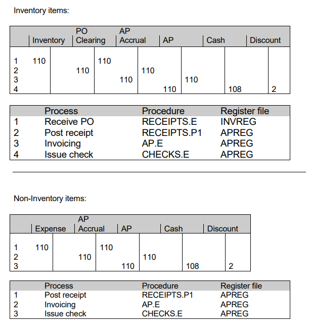
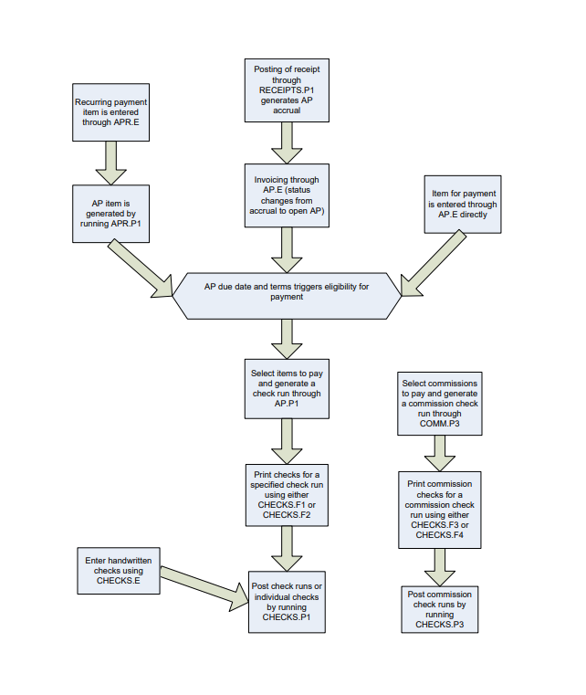

# Accounts Payable: Training Guide

<PageHeader />

This comprehensive training guide covers all aspects of the Rover ERP Accounts Payable module, from initial setup to daily operations and periodic processing.

**Tags:**
<badge text='training' vertical='middle' />
<badge text='accounts-payable' vertical='middle' />
<badge text='ap' vertical='middle' />

## Table of Contents <!-- omit from toc -->

- [Overview](#overview)
- [Setup Procedures](#setup-procedures)
  - [Chart of Accounts Setup (`GLCHART.E`)](#chart-of-accounts-setup-glcharte)
  - [Terms Codes Definition (`TERMS.E`)](#terms-codes-definition-termse)
  - [Accounting Parameters (`ACCT.CONTROL`)](#accounting-parameters-acctcontrol)
  - [AP Controls and Defaults (`AP.CONTROL`)](#ap-controls-and-defaults-apcontrol)
  - [Vendor Master Information (`VENDOR.E`)](#vendor-master-information-vendore)
  - [Recurring Payments Setup (`APR.E`)](#recurring-payments-setup-apre)
  - [Create Recurring Payments (`APR.P1`)](#create-recurring-payments-aprp1)
- [Daily Procedures](#daily-procedures)
  - [AP Invoice Entry (`AP.E`)](#ap-invoice-entry-ape)
  - [Register Date Changes (`AP.E2`)](#register-date-changes-ape2)
  - [Hand Check Entry (`CHECKS.E`)](#hand-check-entry-checkse)
  - [Void and Stop Payments (`CHECKS.E2`)](#void-and-stop-payments-checkse2)
  - [Create AP from Receipts (`RECEIPTS.P1`)](#create-ap-from-receipts-receiptsp1)
- [Check Run Processing](#check-run-processing)
  - [Determine Payment Items (`AP.R3` / `AP.R5`)](#determine-payment-items-apr3--apr5)
  - [Create Check Run (`AP.P1`)](#create-check-run-app1)
  - [Modify Prechecks (`PRECHECKS.E`)](#modify-prechecks-precheckse)
  - [Print Checks](#print-checks)
  - [Post Check Run (`CHECKS.P1`)](#post-check-run-checksp1)
- [Commission Check Processing](#commission-check-processing)
  - [Determine Eligible Commissions (`COMM.R4`)](#determine-eligible-commissions-commr4)
  - [Create Commission Run (`COMM.P3`)](#create-commission-run-commp3)
  - [Cancel Commission Run (`PRECOMM.P1`)](#cancel-commission-run-precommp1)
  - [Print Commission Checks](#print-commission-checks)
  - [Post Commission Checks (`CHECKS.P3`)](#post-commission-checks-checksp3)
- [ACH Processing](#ach-processing)
  - [ACH Setup (`AP.CONTROL`)](#ach-setup-apcontrol)
  - [Vendor Bank Information (`VENDOR.E`)](#vendor-bank-information-vendore)
  - [Select ACH Items (`AP.P1`)](#select-ach-items-app1)
  - [Create ACH File (`CHECKS.P7`)](#create-ach-file-checksp7)
  - [Post ACH Checks (`CHECKS.P1`)](#post-ach-checks-checksp1)
  - [Transmit ACH File (`CHECKS.P8`)](#transmit-ach-file-checksp8)
- [Periodic Processing](#periodic-processing)
  - [AP Distribution Listing (`AP.R10`)](#ap-distribution-listing-apr10)
  - [Accrual Report (`AP.R9`)](#accrual-report-apr9)
  - [Register Listings (`APREG.R1` / `APREG.R2`)](#register-listings-apregr1--apregr2)
  - [Bank Reconciliation (`RECON.E`)](#bank-reconciliation-recone)
  - [General Ledger Interface (`GLINT.P1`)](#general-ledger-interface-glintp1)
- [Year-End 1099 Processing](#year-end-1099-processing)
  - [Generate 1099 Data (`AP1099.P1`)](#generate-1099-data-ap1099p1)
  - [1099 Reports and Edits](#1099-reports-and-edits)
  - [Print 1099 Forms](#print-1099-forms)
- [Process Flow Examples](#process-flow-examples)
  - [Standard Invoice Processing](#standard-invoice-processing)
  - [Purchase Order Flow](#purchase-order-flow)
- [Flow Charts](#flow-charts)
  - [Sample Account Flow "T" Chart](#sample-account-flow-t-chart)
  - [AP Process Flow Chart](#ap-process-flow-chart)
  - [Commissions Accounting Flow Chart](#commissions-accounting-flow-chart)
- [Best Practices](#best-practices)
  - [Data Entry](#data-entry)
  - [Payment Processing](#payment-processing)
  - [Period-End Procedures](#period-end-procedures)
  - [Security and Controls](#security-and-controls)
- [Troubleshooting Common Issues](#troubleshooting-common-issues)
  - [Payment Problems](#payment-problems)
  - [Data Entry Issues](#data-entry-issues)
  - [Report Discrepancies](#report-discrepancies)

## Overview

The Accounts Payable module provides complete functionality for managing vendor invoices, processing payments, and maintaining accurate financial records. This guide walks through each component systematically, ensuring users understand both the setup requirements and operational procedures.

**Prerequisites:**

- General Ledger chart of accounts must be installed
- Basic understanding of accounting principles
- Purchasing module operational (if using receipt-based AP creation)

## Setup Procedures

### Chart of Accounts Setup ([`GLCHART.E`](../AP-ENTRY/AP-E/CHECKS-E/AP-CONTROL/GLCHART-E/README.md))

Before using the Accounts Payable module, you must define all General Ledger account numbers that will be used for AP transactions. This includes:

- **Accounts Payable Control Accounts** - Main liability accounts
- **Expense Accounts** - Various expense categories
- **Cash Accounts** - Bank accounts for payments
- **Discount Accounts** - Purchase discount tracking

### Terms Codes Definition ([`TERMS.E`](../AP-ENTRY/TERMS-E/README.md))

Payment terms define how and when vendors should be paid. Configure various payment terms including:

- **Net Terms** - Standard payment periods (Net 30, Net 60, etc.)
- **Discount Terms** - Early payment discounts (2/10 Net 30)
- **Special Terms** - Custom payment arrangements

Each terms code includes:

- Term name and description
- Number of days for payment
- Discount percentage and discount days
- Processing parameters

### Accounting Parameters ([`ACCT.CONTROL`](../AP-ENTRY/ACCT-CONTROL/README.md))

Configure aging and reporting parameters:

- **Aging Days** - Define aging buckets (30, 60, 90, 120+ days)
- **Report Column Headers** - Customize aging report appearance
- **Processing Options** - Dynamic aging calculations

*Note: Data is processed dynamically rather than stored in bucketed format, providing real-time aging accuracy.*

### AP Controls and Defaults ([`AP.CONTROL`](../AP-ENTRY/AP-E/CHECKS-E/AP-CONTROL/README.md))

Establish default information for the AP module:

- **Default General Ledger Accounts** - Automatically populate common accounts
- **Numbering Sequences** - AP record numbering conventions
- **Payment Processing Options** - Check printing and ACH settings
- **1099 Processing Parameters** - Year-end reporting setup

These defaults pre-populate new AP entries but remain editable on a per-invoice basis.

### Vendor Master Information ([`VENDOR.E`](../AP-ENTRY/VENDOR-E/README.md))

The vendor master file contains essential information for each supplier:

**Basic Information:**

- Vendor number and name
- Complete address and contact details
- Phone, fax, and email information

**Payment Information:**

- Default payment terms
- 1099 reporting requirements
- Preferred payment method (check or ACH)
- Bank account information for ACH payments

**Accounting Defaults:**

- Default expense account
- Sales tax settings
- Currency information (if applicable)

### Recurring Payments Setup ([`APR.E`](../AP-PROCESS/APR-P1/APR-E/README.md))

For regular expenses like rent, utilities, or service contracts:

**Header Information:**

- Vendor selection
- Payment amount
- Frequency and dates
- Terms and payment method

**Detail Information:**

- Part numbers (if applicable)
- Cost distribution
- General Ledger account distribution
- Department or cost center codes

### Create Recurring Payments ([`APR.P1`](../AP-PROCESS/APR-P1/README.md))

This process automatically generates AP records for eligible recurring items:

- Reviews recurring payment schedule
- Creates AP records for due items
- Updates vendor balances
- Creates `APREG` (AP Register) entries for audit trail

## Daily Procedures

### AP Invoice Entry ([`AP.E`](../AP-ENTRY/AP-E/README.md))

The primary data entry screen for accounts payable transactions includes four main sections:

**Header Screen:**

- Vendor selection and validation
- Invoice number and date
- Due date and terms
- Total amount and description

**Details Screen:**

- Line item breakdown
- Part numbers and descriptions
- Quantities and unit costs
- General Ledger account distribution

**Related AP Items:**

- Links to related transactions
- Purchase order references
- Receipt connections

**Register History:**

- Transaction audit trail
- Previous modifications
- Payment history

### Register Date Changes ([`AP.E2`](../AP-ENTRY/AP-E2/README.md))

Modify register dates for specific business requirements:

- **Aging Report Adjustments** - Correct aging calculations
- **General Ledger Balancing** - Align with accounting periods
- **Period Closing** - Ensure proper period assignment

*Use this function carefully as it affects financial reporting accuracy.*

### Hand Check Entry ([`CHECKS.E`](../AP-ENTRY/AP-E/CHECKS-E/README.md))

Enter manually written checks for various purposes:

**Non-AP Expenses:**

- Office supplies purchased with petty cash
- Emergency repairs
- Travel advances

**Prepayment Checks:**

- Vendor advances
- Deposits
- Prepaid expenses

The system tracks these transactions separately while maintaining complete audit trails.

### Void and Stop Payments ([`CHECKS.E2`](../AP-ENTRY/CHECKS-E2/README.md))

Manage problematic payments:

**Void Checks:**

- Mark checks as void
- Automatically re-open associated AP items
- Maintain audit trail of voided transactions

**Stop Payments:**

- Flag checks for bank stop payment
- Prevent duplicate payments
- Track bank fees and adjustments

### Create AP from Receipts ([`RECEIPTS.P1`](../AP-REPORT/APREG-R1/RECEIPTS-P1/README.md))

Automatically generate AP accrual records from purchase order receipts:

- Posts received items to AP
- Creates accrual entries
- Links to original purchase orders
- Maintains three-way match capability

## Check Run Processing

### Determine Payment Items ([`AP.R3`](../AP-REPORT/AP-R3/README.md) / [`AP.R5`](../AP-REPORT/AP-R5/README.md))

Use aging and due date reports to make payment decisions:

**Aging Report ([`AP.R3`](../AP-REPORT/AP-R3/README.md)):**

- Shows outstanding balances by age
- Identifies overdue accounts
- Highlights discount opportunities

**Due Date Report ([`AP.R5`](../AP-REPORT/AP-R5/README.md)):**

- Lists items due for payment
- Sorts by due date and vendor
- Shows available discounts

### Create Check Run ([`AP.P1`](../AP-REPORT/CHECKS-F5/AP-P1/README.md))

Load selected AP items into the Prechecks work file using three methods:

**On-Screen Selection:**

- Interactive item selection
- Real-time balance verification
- Immediate vendor review

**Batch Processing:**

- Automated selection by criteria
- High-volume processing
- Scheduled payment runs

**Manual Entry:**

- Direct precheck creation
- Special payment circumstances
- Override normal selection criteria

### Modify Prechecks ([`PRECHECKS.E`](../AP-ENTRY/PRECHECKS-E/README.md))

Review and adjust items before printing:

- **Payment Amounts** - Modify payment amounts
- **Discount Applications** - Apply or remove discounts
- **Payment Methods** - Change from check to ACH
- **Payment Dates** - Adjust check dates

### Print Checks

Choose appropriate check format:

**Tractor-Feed Forms ([`CHECKS.F1`](../AP-REPORT/CHECKS-F1/README.md)):**

- Continuous-form checks
- High-volume processing
- Standard business checks

**Laser Forms ([`CHECKS.F2`](../AP-REPORT/CHECKS-F2/README.md)):**

- Single-sheet checks
- Professional appearance
- Customizable layouts

### Post Check Run ([`CHECKS.P1`](../AP-PROCESS/CHECKS-P1/README.md))

Complete the payment process:

- Updates AP records with payment information
- Creates register (`APREG`) entries
- Applies payments to vendor balances
- Deletes processed Precheck records
- Updates check register

## Commission Check Processing

### Determine Eligible Commissions ([`COMM.R4`](../AP-REPORT/CHECKS-F4/CHECKS-P3/COMM-P3/COMM-R4/README.md))

Review commission records ready for payment:

- Lists calculated commissions
- Shows payment eligibility
- Identifies commission periods
- Displays salesperson information

### Create Commission Run ([`COMM.P3`](../AP-REPORT/CHECKS-F4/CHECKS-P3/COMM-P3/README.md))

Generate Precomm records for processing:

- Loads eligible commission records
- Creates payment batch
- Validates commission calculations
- Prepares for check printing

### Cancel Commission Run ([`PRECOMM.P1`](../AP-PROCESS/PRECOMM-P1/README.md))

Remove commission items from payment queue:

- Deletes Precomm records
- Unflags COMM records
- Restores original status
- Maintains audit trail

### Print Commission Checks

**Tractor-Feed Forms ([`CHECKS.F3`](../AP-REPORT/CHECKS-F3/README.md)):**

- Continuous commission checks
- High-volume commission processing

**Laser Forms ([`CHECKS.F4`](../AP-REPORT/CHECKS-F4/README.md)):**

- Professional commission checks
- Custom commission layouts

### Post Commission Checks ([`CHECKS.P3`](../AP-REPORT/CHECKS-F4/CHECKS-P3/README.md))

Complete commission payment processing:

- Updates COMM records with payment data
- Creates register entries
- Applies commission payments
- Maintains commission history

## ACH Processing

### ACH Setup (`AP.CONTROL`)

Configure ACH-specific parameters in the Payments tab:

- **Bank Information** - Your bank's ACH details
- **File Formats** - ACH file specifications
- **Transmission Methods** - How files are sent
- **Security Settings** - Authentication requirements

### Vendor Bank Information (`VENDOR.E`)

Maintain vendor banking details:

- **Routing Number** - Bank's nine-digit routing number
- **Account Number** - Vendor's bank account number
- **Account Type** - Checking or savings
- **ACH Email** - Electronic notification address

### Select ACH Items ([`AP.P1`](../AP-REPORT/CHECKS-F5/AP-P1/README.md))

Restrict payment selection to ACH-eligible vendors:

- Use "ACH Only" selection option
- Verifies vendor ACH setup
- Validates bank account information
- Creates ACH-specific prechecks

### Create ACH File ([`CHECKS.P7`](../AP-PROCESS/CHECKS-P7/README.md))

Generate the electronic file for bank processing:

- Creates standard ACH format
- Includes all required banking data
- Validates file structure
- Prepares for transmission

### Post ACH Checks ([`CHECKS.P1`](../AP-PROCESS/CHECKS-P1/README.md))

Update system records before transmission:

- Posts ACH payments to AP
- Updates vendor balances
- Creates register entries
- Maintains audit trail

### Transmit ACH File (`CHECKS.P8`)

Send the ACH file to your bank:

**Manual Transmission:**

- File upload to bank portal
- Email transmission
- Secure file transfer

**Automated Submission:**

- Direct bank connectivity
- Scheduled transmissions
- Automated confirmations

## Periodic Processing

### AP Distribution Listing ([`AP.R10`](../AP-REPORT/AP-R10/README.md))

Summarize invoice General Ledger distribution:

- Shows account impact by period
- Identifies distribution patterns
- Supports GL reconciliation
- Assists in budgeting analysis

### Accrual Report ([`AP.R9`](../AP-REPORT/AP-R1/AP-R9/README.md))

List uninvoiced AP items as of cutoff date:

- Shows received but not invoiced items
- Supports period-end accruals
- Identifies timing differences
- Assists in financial statement preparation

### Register Listings ([`APREG.R1`](../AP-REPORT/APREG-R1/README.md) / [`APREG.R2`](../AP-REPORT/APREG-R2/README.md))

Review detailed register activity:

**Detailed Register ([`APREG.R1`](../AP-REPORT/APREG-R1/README.md)):**

- Complete transaction history
- All register entries
- Full audit trail

**Filtered Register ([`APREG.R2`](../AP-REPORT/APREG-R2/README.md)):**

- Specific date ranges
- Selected vendors
- Particular transaction types

### Bank Reconciliation ([`RECON.E`](../AP-ENTRY/ACCT-CONTROL/ACCT-CONTROL-1/ar-e/AR-E-1/CASH-E/CASH-E-1/RECON-E/README.md))

The bank reconciliation procedure is used to enter cleared amounts and dates for checks and deposits after they have been processed by the bank:

**Primary Functions:**

- **Track Variances** - Monitor differences between originally entered amounts and bank-registered amounts
- **Clear Items** - Mark checks and deposits as cleared by the bank
- **Handle Adjustments** - Account for bank statement entries that don't correspond to specific system entries
- **Reconcile Statements** - Compare system balances with bank statement balances

**Important Notes:**

- This procedure has **no General Ledger impact**
- Any adjustments or variances must be processed through valid module procedures or journal entries
- Only checks and deposits that already exist in the system can be reconciled
- System only loads items that haven't been flagged as cleared

**After Saving:**

- Deposits and checks are flagged as cleared in the system
- Reconciliation record can be reopened using existing Recon ID
- Bank reconciliation listing available via [`RECON.R1`](../../GL-OVERVIEW/GL-REPORT/RECON-R1/README.md) report

### General Ledger Interface ([`GLINT.P1`](../AP-ENTRY/AP-E/CHECKS-E/AP-CONTROL/GLCHART-E/GLCHART-E-1/GL-CONTROL/GL-CONTROL-1/GLINT-P1/README.md))

Transfer AP activity to General Ledger:

- Summarizes register files into `GLINT`
- Prevents duplicate postings
- Maintains period integrity
- Creates GL posting batches

## Year-End 1099 Processing

### Generate 1099 Data ([`AP1099.P1`](../AP-REPORT/AP1099-R1/AP1099-P1/README.md))

Compile data for 1099 reporting:

- Pulls AP transaction data
- Includes check payment information
- Filters by 1099 vendor flag
- Accumulates by vendor and box

### 1099 Reports and Edits

**Audit 1099 Data ([`AP1099.R1`](../AP-REPORT/AP1099-R1/README.md)):**

- Review 1099 calculations
- Identify potential issues
- Verify vendor information

**Modify 1099 Data ([`AP1099.E`](../AP-ENTRY/AP1099-E/README.md)):**

- Adjust vendor/representative data
- Correct calculation errors
- Handle special circumstances

**Check Adjustments ([`CHECKS.E3`](../AP-ENTRY/CHECKS-E3/README.md)):**

- Modify individual check 1099 status
- Correct 1099 amounts
- Handle reclassifications

### Print 1099 Forms

**Continuous Forms ([`AP1099.F1`](../AP-REPORT/AP1099-F1/README.md)):**

- High-volume 1099 printing
- Standard IRS forms

**Laser Forms ([`AP1099.F2`](../AP-REPORT/AP1099-F2/README.md)):**

- Professional appearance
- Single-sheet forms
- Custom layouts

## Process Flow Examples

### Standard Invoice Processing

1. **Setup Phase:**
   - Vendor master created
   - Terms established
   - GL accounts defined

2. **Invoice Entry:**
   - Invoice data entered via `AP.E`
   - GL distribution specified
   - Approval workflow (if applicable)

3. **Payment Processing:**
   - Items selected for payment
   - Prechecks created and reviewed
   - Checks printed and posted

4. **Reconciliation:**
   - Bank reconciliation performed
   - GL interface executed
   - Period closing procedures

### Purchase Order Flow

1. **Purchase Order Created:**
   - PO issued to vendor
   - Items specified with accounts

2. **Receipt Processing:**
   - Goods received via `RECEIPTS.E`
   - Accrual created via `RECEIPTS.P1`

3. **Invoice Matching:**
   - Vendor invoice received
   - Three-way match performed
   - Discrepancies resolved

4. **Payment:**
   - Standard payment processing
   - Complete audit trail maintained

## Flow Charts

### Sample Account Flow "T" Chart

### AP Process Flow Chart

### Commissions Accounting Flow Chart

**Notes:**

- Remember that Reps are not set up as vendors in Rover.
- Commissions are not APs but they do post to the AP register.
- If you need to collect 1099 data for reps, you should use the automated method above (with `CHECKS.P3`).

## Best Practices

### Data Entry

- Always verify vendor information before creating new vendors
- Use consistent account coding for similar expenses
- Review GL distribution before saving transactions
- Maintain supporting documentation for all entries

### Payment Processing

- Review aging reports regularly to identify payment priorities
- Take advantage of early payment discounts when beneficial
- Maintain adequate cash flow for payment obligations
- Use ACH processing for recurring payments to reduce costs

### Period-End Procedures

- Run accrual reports for uninvoiced receipts
- Reconcile AP sub-ledger to GL control accounts
- Review aging for potential collection issues
- Ensure all transactions are properly classified

### Security and Controls

- Implement proper segregation of duties
- Require approval for large payments
- Regularly review vendor master changes
- Monitor check stock and secure blank checks

## Troubleshooting Common Issues

### Payment Problems

- **Check Won't Print:** Verify printer setup and check stock alignment
- **ACH Rejected:** Confirm vendor bank account information accuracy
- **Duplicate Payments:** Review payment history before processing

### Data Entry Issues

- **Invalid Account:** Verify GL account exists and is active
- **Terms Error:** Confirm terms code is properly defined
- **Vendor Not Found:** Check vendor number and verify vendor exists

### Report Discrepancies

- **Aging Incorrect:** Verify register dates and aging parameters
- **GL Out of Balance:** Run GL interface and check posting dates
- **1099 Issues:** Review vendor 1099 flags and payment classifications

<PageFooter />
