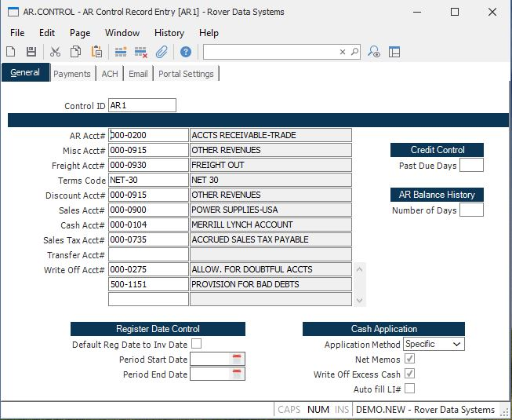

##  AR Control Record Entry (AR.CONTROL)

<PageHeader />

##

**Control.ID** The control id is the company code (as defined on screen 2 of
CO.CONTROL) preceded by "AR". If you only have one company code the control id
will automatically be inserted into this procedure for you. If you have
multiple company codes you may select from a list of available companies or
you may enter the id directly e.g. AR3. This record contains the default
information used in the AR module by company code.  
  
**AR Acct#** This is the default Accounts Receivable account used by the [ AR.E ](../../../../../../rover/AP-OVERVIEW/AP-ENTRY/ACCT-CONTROL/ACCT-CONTROL-3/AR-E) procedure. This is loaded into the AR record automatically and can be changed as required.   
  
**Misc Acct#** This field can be used to default an account number into the
Miscellaneous Account field, after a Miscellaneous amount has been entered.
This should be used when the account number is most often the same, thus
saving data entry keystrokes.  
  
**Freight Acct#** This field can be used to default an account number into the
Freight Account field, after a Freight amount has been entered. This should be
used when the account number is most often the same, thus saving data entry
keystrokes.  
  
**Terms Code** This field should contain a default terms code, which will be
used in the AR module if a customer is used for which a terms code has not
been previously defined.  
  
**Discount Acct#** This field can be used to default an account number into
the Discount Account field, after a terms discount amount has been entered or
calculated. This should be used when the account number is most often the
same, thus saving data entry keystrokes. This account number cannot be the
same as the a/r trade account number.  
  
**Sales Acct#** This field can be used to default an account number into the [ AR.E ](../../../../../../rover/AP-OVERVIEW/AP-ENTRY/ACCT-CONTROL/ACCT-CONTROL-3/AR-E) line item Distribution account field, after a Distribution amount has been entered. This should be used when the account number is most often the same, thus saving data entry keystrokes.   
  
**Cash Acct#** This field can be used to default an account number into the Cash Account field in [ CASH.E ](CASH-E/README.md) .   
  
**Sales Tax Acct** Enter the account number to be used for collection of sales
tax. This field is used if sales tax has been charged and no valid account
number was found in the STAX record.  
  
**Transfer Clearing Acct** This field can be used to default an account number into the Clearing Account field in [ CASH.E5 ](CASH-E5/README.md) .   
  
**Write Off Acct** Enter the account number which may be used in [ CASH.E ](CASH-E/README.md) when an amount is being written-off. There are two options for entry into this field: 1. Enter a single account number and it will be used without prompting. 2. Enter a list of account numbers and the user will be prompted to select one.   
  
**Write Off Acct Description** This field contains the description of the
associated account number and is for reference only.  
  
**Past Due Days** This field will control the credit check in sales order
entry. This field is a system-wide control field. All customers, which do not
have an overriding number of days specified, will use this number of days. If
you wish to place orders on hold when the customer is 1 day past due on any of
their invoices, enter 1. Enter 2 for 2 days past due, etc.  
  
**Default Reg Date** In [ AR.E ](../../../../../../rover/AP-OVERVIEW/AP-ENTRY/ACCT-CONTROL/ACCT-CONTROL-3/AR-E) , the register date defaults to the current system date. If you wish to default the register date to the invoice date, then set this field.   
  
**Period Start Date** This field is used to control the entry of dates in the AR module and in the shipping entry procedures such as [ ship.e ](ship-e/README.md) and [ ship.e2 ](ship-e2/README.md) . When used in conjunction with the period end date, it can ensure that dates entered are within an acceptable range. This is especially helpful when used to keep from posting records into a previously closed period.   
  
**Period End Date** This field is used to control the entry of dates in the AR
module. When used in conjunction with the period start date, it can ensure
that dates entered are within an acceptable range. This is especially helpful
when used to keep from posting records into a future period.  
  
**Cash App Method** Select the default application type which is to be used in the [ CASH.E ](CASH-E/README.md) procedure. This application method will automatically load and can be changed during the procedure as required. Select the method which is most often used. Options are:   
Specific - Specific invoices  
Oldest - Oldest invoice first  
Range - User specified  
  
**Net Memos** If, during [ CASH.E ](CASH-E/README.md) , one of the automatic apply methods are used, do you want to net credit memos and on account records during the processing of a range of AR items? If so, check this box.   
  
**Write off Excess Cash** Check this box if you want to allow [ CASH.E ](CASH-E/README.md) to write off excess cash received instead of requiring it to be applied as an on-account item. If this is allowed, a message will be displayed upon filing the CASH entry to verify this when a positive balance remains. The write off account listed above will be used. If multiplie write off accounts are listed the user will be presented with the list to choose from.   
  
**AR Account Desc** This field contains the description of the AR account
number.  
  
**Misc Account Desc** This field contains the description of the associated
account number and is for reference only.  
  
**Freight Acct Description** This field contains the description of the
associated account number and is for reference only.  
  
**Terms Description** This field contains the description of the associated
terms coder and is for reference only.  
  
**Discount Acct Description** This field contains the description of the
associated account number and is for reference only.  
  
**Sales Acct Description** This field contains the description of the
associated account number and is for reference only.  
  
**Cash Acct Description** This field contains the description of the
associated account number and is for reference only.  
  
**Sales Tax Acct Description** This field contains the description of the
associated account number and is for reference only.  
  
**Clearing Acct Description** This field contains the description of the
associated account number and is for reference only.  
  
  
<badge text= "Version 8.10.57" vertical="middle" />

<PageFooter />