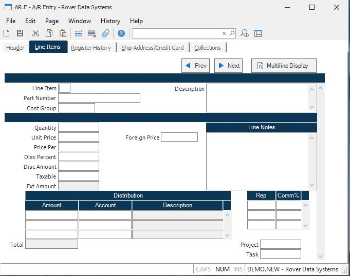

##  A/R Entry (AR.E)

<PageHeader />

##  Line Items

**Li#** The line item number. Used for sequential identification of part
number related charges.  
  
**Part Number** The part number sold to the customer. If this record was
generated by the shipment process, this field cannot be changed. For non-
inventory charges, leave this field blank and enter a description only.  
  
**Description** If a part number was entered, this is the description from the
Parts file. If no part number was entered, you may enter any description of
the charge on this line item you wish.  
  
**Quantity** The item quantity being charged to the customer.  
  
**Unit Price** The unit price being charged to the customer. This is the un-
discounted price.  
  
**Price Per** The price per used in conjunction with the unit price being
charged to the customer. For example, if the material being sold is priced
"per hundred", then 100 should be entered into this field.  
  
**Disc Percent** A discount percent being allowed on this line item. This is a
specific discount being applied to this part only.  
  
**Disc Amount** The amount of discount be given on this line. This field is
calculated as: Quantity X Unit price X Discount  
  
**Tax Flag** If this line item is taxable, enter 'Y'. Otherwise, either enter
'N' of leave blank.  
  
**Ext Price** The extended price for this line item, calculated based upon
quantity, price, price per and discount. This is the amount which must be
fully distributed to the general ledger account numbers.  
  
**Line Notes** Any general notes which apply to this line item.  
  
**Amount** This field represents a distribution of the line item extension
amount to general ledger account numbers.  
  
**Account#** The account number for each amount distribution.  
  
**Account Description** This field contains the account description and is for
reference only.  
  
**Rep#** The sales rep who is to receive commission for this order. This field
is defaulted from the sales reps entered into the header.  
  
**Comm%** The commission percent(s) given to each sales rep. This field is
loaded from the Rep file and can be changed if required.  
  
**Foreign Price** If a currency code and exchange rate are present on the
header, then the foreign price will be displayed here. The foreign price can
also be entered or changed here, and the price will be recalculated based on
the exchange rate.  
  
**Cost Group** Enter the cost group which will be validated against [ INV.CONTROL ](../../../../../../../rover/AP-OVERVIEW/AP-ENTRY/AP-E/AP-E-2/INV-CONTROL) . The cost group is used to define the costing method for this AR item when SALES and COMM records are created.   
  
**Project Id** If this AR line item is for a project, enter the project
number. This will cause the revenue associated with this AR line item to be
added into the project's revenue.  
  
**Task Id** Enter the task ID associated with the project for this AR line
item. A lookup is provided to show all the tasks for the project.  
  
**Total** The total of the amount distributions.  
  
**Prev** Click on this button to move to the previous line item.  
  
**Next** Click on this button to move to the next line item.  
  
**Multiline Display** Click on this button to display all line items is a grid
format.  
  
  
<badge text= "Version 8.10.57" vertical="middle" />

<PageFooter />