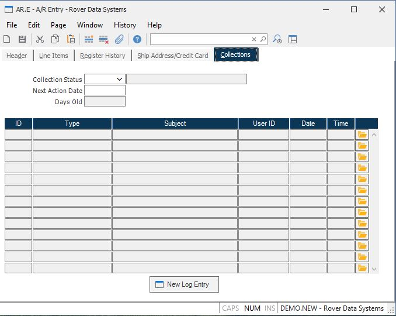

##  A/R Entry (AR.E)

<PageHeader />

##  Collections

**Collect Status** Enter the status of collections for this AR item. The list may be pre-defined in [ ACCT.CONTROL ](../../../../../../../rover/AP-OVERVIEW/AP-ENTRY/ACCT-CONTROL) .   
  
**Next Date** Enter the next date on which action is required for this AR
item.  
  
**Days Old** This fields calculates the number of days since the invoice date.  
  
**Log ID** This field contains the LOG ID for the associated information.  
  
**Type** Thie field contains the type, as found in the LOG record.  
  
**Subject** This field contains the subject from the log record.  
  
**User ID** Thei field contains the user ID that originated the log record.  
  
**Date** This field contains the date that the log record was created.  
  
**Time** This field contains the time that the log record was created.  
  
**** Select this button to open the associated log entry.  
  
**New Log Entry** Press this button to open a new log entry.  
  
**Status desc** This field contains the status of the status code entered, as read from [ ACCT.CONTROL ](../../../../../../../rover/AP-OVERVIEW/AP-ENTRY/ACCT-CONTROL) .   
  
  
<badge text= "Version 8.10.57" vertical="middle" />

<PageFooter />