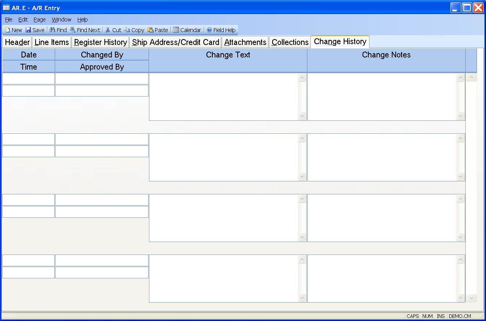

##  A/R Entry (AR.E)

<PageHeader />

##  Change History

**Change Date** The date the invoice was changed. This is only stored if one of two conditions are met: 1) The parameters are set in [ CHANGE.CONTROL ](../../../../../../../rover/AP-OVERVIEW/AP-ENTRY/VENDOR-E/VENDOR-E-5/CHANGE-CONTROL) and a change was made that met the criteria for storing change history or 2) Change notes were entered by the user. This is system controlled and cannot be changed by the user.   
  
**Change Time** The time the invoice was changed. This is system controlled
and cannot be changed by the user.  
  
**Changed By** The User ID of the person who changed the invoice. This is
system controlled and cannot be changed by the user.  
  
**Approved By** Enter the name or initials of the person who approved the
invoice change.  
  
**Change Text** This is change text that is generated by the system based on the settings in [ CHANGE.CONTROL ](../../../../../../../rover/AP-OVERVIEW/AP-ENTRY/VENDOR-E/VENDOR-E-5/CHANGE-CONTROL) defining which fields trigger a change. Changes to those fields will be noted here. This text will also be included in invoice change notices sent by email.   
  
**Change Notes** Enter any notes associated with changes made on this date and
time. These notes will also be included in invoice change notices sent by
email.  
  
  
<badge text= "Version 8.10.57" vertical="middle" />

<PageFooter />