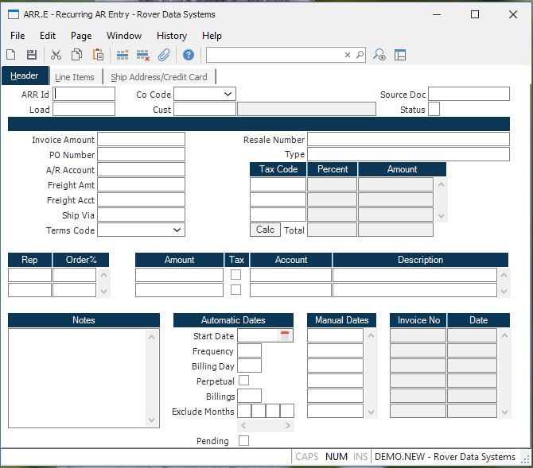

##  Recurring AR Entry (ARR.E)

<PageHeader />

##  Header

**ARR Id** If you wish to access an ARR record which already exists, enter
that number. If you wish to enter a new ARR record, you may either enter a new
ID now, or leave this field null to assign a new ARR ID when the record is
filed.  
  
**Co Code** Enter the company code the recurring invoices should be applied
to.  
  
**Customer** Enter the customer number who will be invoiced. The customer
number must exist on the  
CUST file. Customer name will display to the right of prompt after entry for
verification.  
  
**Customer Name** This is the customer name as read from the CUST file.  
  
**Source Doc** Enter the source document number which generated this recurring
AR item.  
  
**Status** This is a system controlled field indicating the status of this ARR
item: O = Open C = Closed /  
  
**Inv Amount** Enter the net amount of the invoice. This is the actual amount
owed by the customer. The amount entered here must equal:  
Total of all line item amounts  
\+ Miscellaneous amounts  
\+ Freight  
  
**PO#** Enter the purchase order number against which this ARR record is being
entered. This is an optional field.  
  
**AR Acct#** Enter the G/L account number against which the AR records will be charged. This account number is defaulted from the [ AR.CONTROL ](../../../../../../../../../../../rover/AP-OVERVIEW/AP-ENTRY/CHECKS-E4/AR-CONTROL) file and can be changed if necessary.   
  
**Freight Amt** Enter the freight amount which is being charged on this
invoice.  
  
**Freight Acct#** Enter the G/L account number to which the freight amount is
being charged.  
  
**Ship Via** Enter the designation for the shipping method to be used.  
  
**Terms Code** Enter the terms code which identifies the terms to which the
customer agreed. This is defaulted CUST file and can be changed as required.  
  
**Resale#** Enter the resale number for the customer if any items are non-
taxable.  
  
**Rep** Enter the number of the Rep which gets credit for all AR items
generated. This field is associated with the Order Pct field which follows.  
  
**Order%** Enter the percent of each order which will be credited to the
associated Rep. This field can be used for splitting orders between multiple
Reps.  
  
**Tax Code** The sales tax code to be used for this item. This field is
originally loaded from the customer file and may be changed as necessary.  
  
**Tax Pct** The sales tax percent, as read from the STAX file.  
  
**Tax.Amt** The amount of sales tax for the associated sales tax code.  
  
**Tax Rate** Enter the tax rate to be applied to all AR records created.  
  
**Total Sales Tax** The total amount of sales tax for this record.  
  
**Misc Amounts** Enter any miscellaneous amounts which have been added to the
invoice. This field is  
multi-valued and can contain any number of amount, associated with the
miscellaneous  
descriptions and account numbers.  
  
**Misc Taxable** Check this box if the associated miscellaneous charge is
taxable.  
  
**Misc Acct#** Enter the account number to which the miscellaneous amount is
being distributed.  
  
**Misc Desc** Enter a brief description of the charge(s) being added to the
invoice.  
  
**Notes** Enter any notes which apply to this ARR item.  
  
**Start Date** Enter the first date on which an AR record is to be created.
This entry will be affected by the day number entered in the Billing Day
field. For example, if you enter 03-12-2006 in this field but specify the
billing day as 1 your first billing will actually occur on 04-01-2006. It will
always occur on the first billing day after the date specified.  
  
**Frequency** Enter the number of months between each billing. For example, if
you wanted to bill quarterly you would enter 3. For twice yearly you would
enter 6. If no entry is made then 1 is assumed.  
  
**Day** Enter the day of the month on which the AR record is to be generated
from this recurring record. For example, if you want to generate an invoice on
the 10th of each month, enter 10 here.  
  
**Perpetual** Check this box if billings are to continue indefinitely.
Otherwise, enter the number of billings to be done in the Billings field.  
  
**Number ARs** Enter the number of times this recurring record should create
an AR record. For example, if this record is being entered to generate a
monthly bill over the course of a year, enter 12. Leave this field blank if
you have checked the Perpetual check box.  
  
**Manual Dates** If you do not use the automatic option you may specify the
dates manually by entering each date on which you want a billing to be
generated. If there are entries in this field they will take precedence over
the automatic option settings. Even after the dates in this field have been
exhausted the automatic settings will not be used.  
  
**Invoice No** These are the Invoice record Id's which were created for this
recurring record, on the dates listed.  
  
**Invoice Date** Displays the date on which the invoice was created by the [ ARR.P1 ](../../../../../../../../../../../rover/AP-OVERVIEW/AP-ENTRY/ACCT-CONTROL/ACCT-CONTROL-1/ar-e/AR-E-4/AR-F2/ARR-P1) process.   
  
**Calc** Click this button to calculate the tax rate for the address entered
on the Ship Address page.  
  
  
<badge text= "Version 8.10.57" vertical="middle" />

<PageFooter />