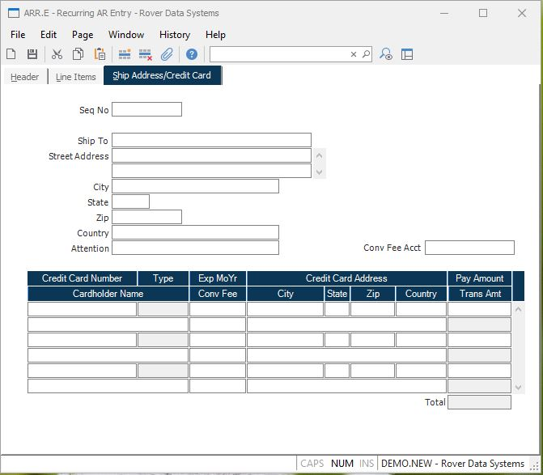

##  Recurring AR Entry (ARR.E)

<PageHeader />

##  Ship Address/Credit Card

**Ship Seq** Contains the shipping sequence number defined in [ cust.e ](../../../../../../../../../../../rover/AP-OVERVIEW/AP-ENTRY/ACCT-CONTROL/ACCT-CONTROL-1/ar-e/AR-E-1/CASH-E/recon-e/RECON-E-2/CASH-E4/CASH-E4-1/cust-e) .   
  
**Ship Name** Enter the name of the company.  
  
**Ship Address** Contains the ship to address.  
  
**Ship City** Contains the ship to city.  
  
**Ship State** Contains the ship to state.  
  
**Ship Zip** The zip/postal code the shipment is being delivered to.  
  
**Ship Country** Enter the country this shipment will be sent to.  
  
**Ship Attn** Enter the name of the person or contact that this shipment is
being delivered to.  
  
**Creditcard Number** If all or part of the payment is being made with a
credit card enter each credit card to be billed. Card numbers that were
entered previously will only show the last four digits of the card number for
security purposes.  
  
**Creditcard Type**  
  
**Creditcard Name** Enter the name of the person that appears on the credit
card.  
  
**Creditcard Exp** Enter the expiration month and year for the credit card in
the format mmyy. For example, March of 2006 would be entered as 0306.  
  
**Creditcard Avs** If this box is checked the customer address was verified
against the credit card. This provides an additional level of security and can
reduce the charges for the transaction from the credit card service.  
  
**Creditcard Address** If the associated AVS box is checked the street address
in this field will be used for address verification. If the credit card was
loaded from the customer master record the address will also be loaded from
there. Otherwise, the address is loaded from the ship address. Note: Only the
first line of the street address (i.e. 123 Main Street) should be entered into
this field. Do not include the city, state or country.  
  
**Creditcard City** Enter the billing city for the associated credit card.  
  
**Creditcard State** Enter the billing state for the associated credit card.  
  
**Creditcard Zip** If the associated AVS box is checked the zip code in this
field will be used for address verification. If the credit card was loaded
from the customer master record the zip code will also be loaded from there.
Otherwise, the zip code is loaded from the ship address zip code.  
  
**Creditcard Country** Enter the billing country for the associated credit
card.  
  
**Creditcard Amt** Enter the amount to be charged to each credit card.  
  
**Creditcard Total** Displays the total amount of the credit cards.  
  
  
<badge text= "Version 8.10.57" vertical="middle" />

<PageFooter />