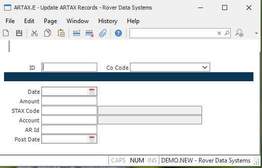

##  Update ARTAX Records (ARTAX.E)

<PageHeader />

##

**ID** The sequential ID of the ARTAX file.  
  
**Co Code** Enter the company code this record should be applied against. The
company code must exist in the CO.CONTROL procedure.  
  
**Date** The date that the ARTAX record was created.  
  
**Amount** The amount of tax for the tax code in this record.  
  
**STAX.Code** The sales tax code as is appears on the AR item.  
  
**Account** The general ledger account number assigned to the tax code.  
  
**AR.Id** The ID of the record in the AR file which created this ARTAX record.  
  
**Post Date** The date this record was posted.  
  
**Description** The description of the GL account number, as read from the
GLCHART file.  
  
**Tax Code Description** The description of the sales tax code, as read from
the STAX file.  
  
  
<badge text= "Version 8.10.57" vertical="middle" />

<PageFooter />