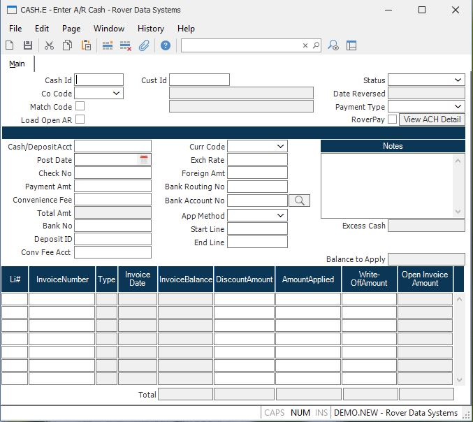

##  Enter A/R Cash (CASH.E)

<PageHeader />

##  Main

**Cash Id** This is a sequentially assigned number used to identify the cash
batch you are entering. The number will be assigned and displayed when the
record is filed. To review a previously posted cash record, enter the cash
number.  
  
**Co Code** Enter the company code the check was issued for. Payment can only
be applied for A/R records with a matching company code. The company code must
be pre-defined in the CO.CONTROL procedure.  
  
**Load Open AR** Check this box load all open AR items for the customer
selected.  
  
**Cust Number** Enter the customer number who is making the payment. If you do
not know the customer's  
number, there is an option in the help menu for this prompt which allows you
to select the  
customer by name.  
  
**Cust Name** The name of the customer, as read from the CUST file.  
  
**Address** This portion of the address is used to verify you have selected
the proper customer.  
  
**Status** On existing records, the status of the transaction will be
displayed in this field. This field cannot be updated manually.  
  
There is a lookup option available from this field to display the recon id
that the deposit was cleared against.  
  
**Reverse Date** If the cash transaction was reversed, the date it was
reversed on will appear in this field.  
  
**Cash Account** Enter the General Ledger account number to be debited for the
cash amount. This number will default from the AR Control record and can be
over-ridden if required. This field may be changed on records with a status of
POSTED. This field cannot be changed on records that have been cleared or
reversed. Changing the date will cause an update to the general ledger.
Therefore, both the original and new post dates must fall in an open fiscal
period.  
  
**Post Date** Enter the transaction date which should indicate when the
payments were applied. This date will be used to calculate any discounts which
should be allowed. This field may be changed on records with a status of
POSTED. This field cannot be changed on records that have been cleared or
reversed. Changing the date will cause an update to the general ledger.
Therefore, both the original and new post dates must fall in an open fiscal
period.  
  
**Check Number** Enter the number from the check which the customer is using
to make the payment. If you are not applying a check, but are 'netting'
invoices, enter any code you wish which will indicate what you are doing. If
required, the check number is one of several fields that can be changed on
existing records.  
  
**Check Amount** Enter the net amount (face value) of the check. This is the
actual amount of money being applied.  
  
**Bank Number** Enter the bank number for this cash transaction. This number will print on the deposit slip form , [ CASH.F1 ](../../../AR-REPORT/CASH-F1/README.md) . If required, the bank number is one of several fields that can be changed on existing records.   
  
**Deposit.ID** This field is used to assign a "deposit batch" number to a series of cash entries. These cash entries may then be reported as a group. Deposit slips may, also, be printed via [ CASH.F1 ](../../../AR-REPORT/CASH-F1/README.md) . If you will be using [ RECON.E ](RECON-E/README.md) to reconcile your bank statements, a deposit id is recommended. If required, the deposit id is one of several fields that can be changed on existing records.   
  
**Currency Code** If this cash receipt is in a foreign currency, enter the currency code here. That will load the exchange rate defined in [ CURRENCY.CONTROL ](../../CURRENCY-CONTROL/README.md) .   
  
**Exchange Rate** This is the exchange rate associated with the currency code as defined in [ CURRENCY.CONTROL ](../../CURRENCY-CONTROL/README.md) . It can be changed as needed.   
  
**Foreign Amount** If this cash receipt is in a foreign currency, enter the
foreign check amount here. Based on the exhange rate above, the domestic
currency check amount will be calculated.  
  
**App Method** Select the method the check amount is to be applied to
invoices:  
Specific - Apply amounts to specific invoices  
Oldest - Apply to oldest invoice first  
Range - Apply to a range of  
  
**Start Line Item** If application type "Range" was selected, enter the
starting line item to be used for the range.  
  
**End Line Item** If application type "Range" was selected, enter the ending
line item to be used for the range.  
  
**Balance** This is a running balance for this Cash record. It displays the
amount of the check yet to be applied.  
  
**Li#** Enter a line item number which will uniquely identify each invoice
being paid. This will be a sequential number. This field (and all associated
data) will automatically be loaded if the user opted to load all customer
data. Additional lines may be added to create credit and/or debit memos.  
  
**AR Id** The record ID in the AR file of the item being paid. This can be an
invoice, credit memo or an on-account record. To create new credit/debit
memos, either leave this field empty or enter a number which does not currenty
exist on the AR file.  
  
**Type** This is the AR type: IN - Invoice CM - Credit Memo DM = Debit OA - On  
  
**Inv Date** The invoice date from the AR record.  
  
**Open Invoice Amount** This field contains the open amount left on the
invoice. This field is displayed for reference and cannot be changed.  
  
**Inv Balance** The balance of the AR item after the discount, applied and
write-off amounts have been applied.  
  
**Disc Amount** The discount amount being allowed for this invoice, based upon
the terms entered on the invoice and the invoice due date. This amount is
automatically defaulted, but can then be changed as required. There is a
lookup option from this field to display the g/l account number that the
discount amount was applied to.  
  
**Amount** The application amount for this transaction. This field will
default to the invoice balance, less discount, provided that the check running
balance is sufficient. If not, this amount will default to the remainder of
the running balance. To create new credit and/or debit memos, enter the
desired amount in this field. For credit memos, enter the number as a positive
number.  
  
**Write Off Amount** The amount of the invoice on this line which should be
written off because payment will not be received from the customer. This
amount should not be included in the check amount. Example: There are two open
invoices for a $100.00 each for the customer. You receive a check for $100.00
for one of the invoices and you agree to write off the second invoice. For the
invoice that will be paid, a $100.00 should be entered in the AMOUNT APPLIED
field. For the invoice that will not be paid, a $100.00 should be entered in
the WRITE-OFF AMOUNT field. The check amount should be for $100.00 not $200
since $100 is the amount that will be deposited into the bank/cash account.  
  
On existing records, there is a lookup option from this field to display the
g/l account number the the write-off amount was applied to.  
  
**Total Open Amount** The total open amount for all invoices.  
  
**Tot Inv Balance** The total of all the invoices listed in this column.  
  
**Tot Disc Amount** The total of all discount amounts allowed.  
  
**Total Amount** The total of all applied amounts entered.  
  
**Total Write Off** The total of all write offs entered.  
  
**Notes** Enter any notes desired. If required, the notes are one of several
fields that can be changed on existing records.  
  
**Excess Cash** An amount will only appear in this field on existing records
if excess cash was received from the customer. Entries cannot be made into
this field on new transactions. There is a lookup option from this field to
display the g/l account number that the excess cash was applied to.  
  
  
<badge text= "Version 8.10.57" vertical="middle" />

<PageFooter />