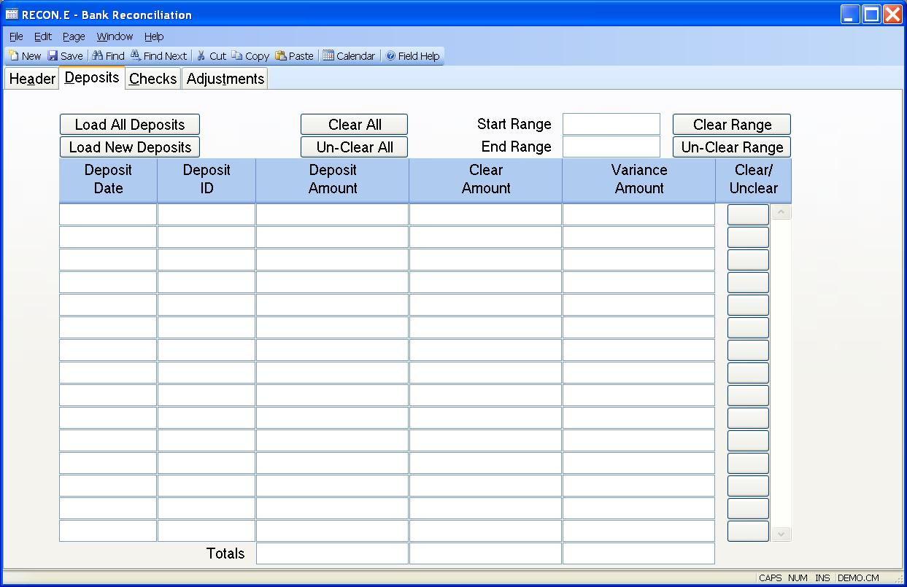

##  Bank Reconciliation (RECON.E)

<PageHeader />

##  Deposits

**Load All Deposits** This button can be pressed to load all deposits for the date range found on the first tab. The deposits that are loaded into this record for you come from the CASH records that have been created via [ CASH.E ](../../../../../../../../../../rover/AP-OVERVIEW/AP-ENTRY/ACCT-CONTROL/ACCT-CONTROL-1/ar-e/AR-E-1/CASH-E) , [ CASH.E3 ](CASH-E3/README.md) or [ CASH.E4 ](CASH-E4/README.md) . If deposits have already been entered into the section below, pressing this button will over-write that data. If you only want to load in deposits that have been entered since the RECON record was last updated, use the 'LOAD NEW DEPOSITS' button.   
  
**Load New Deposits** Press this button to load in any deposits that have been created since the RECON record was last updated. The deposits that are loaded into this record for you come from the CASH records that have been created via [ CASH.E ](../../../../../../../../../../rover/AP-OVERVIEW/AP-ENTRY/ACCT-CONTROL/ACCT-CONTROL-1/ar-e/AR-E-1/CASH-E) , [ CASH.E3 ](CASH-E3/README.md) or [ CASH.E4 ](CASH-E4/README.md) . This option will not over-write any deposit data that has already been entered into this procedure. This option is helpful when you are reconciling daily or weekly and not just at month end.   
  
**Clear All** Press this button to clear all items. Please note that if some
of the deposits do not clear after selecting this option, it is because the
deposit has already been cleared. There is a lookup option on the deposit date
field which will list all cash records that comprise the deposit amount. This
lookup will, also, show you which of those cash records have been cleared.  
  
**Un-Clear All** Toggle button to reverse the clear all.  
  
**Start Range** To clear a range of deposit dates, enter the starting date for
the range.  
  
**Ending Range** Enter the ending date for the range to be selected.  
  
**Clear Range** If a range has been entered, the user may clear the ranges.
Please note that if some of the deposits do not clear after selecting this
option, it is because the deposit has already been cleared. There is a lookup
option on the deposit date field which will list all cash records that
comprise the deposit amount. This lookup will, also, show you which of those
cash records have been cleared.  
  
**Un-Clear Range** Reverse the Clear Range.  
  
**Dep Date** This field contains the date of the associated deposit
information. The deposit amount that appears on this line is a total of all
cash records for this date and the corresponding deposit ID, if present. There
is an option to view all cash records that comprise this deposit. A deposit
amount can be deleted from this field. If the deposit has been cleared, you
will need to save the record before re-loading it into this or another recon
record. However, to load in a deposit select the 'load all deposits' or the
'load new deposits' option above.  
  
**Dep Id** This field contains the deposit ID for the accumulated cash receipt
records. This field may be empty, indicating that no deposit ID was used for
the records found for the deposit date.  
  
**Dep Amt** This is the total amount from the cash receipt records for the
associated deposit date and ID.  
  
**Dep Clear Amt** If the amount shown on the bank statement differs from the
deposit amount shown, enter the statement amount here. This field will default
the the deposit amount.  
  
**Dep Var Amt** This field contains the difference between the deposit amount
and the clear amount and may not be changed manually.  
  
**** Pressing this button will toggle the status of the associated deposit
between cleared and uncleared.  
  
**Deposit Total** Contains the total of the deposit amount column.  
  
**Total Deposit Cleared** This field contains the total of the deposit cleared
amount column.  
  
**Total Deposit Variance** This field contains the total of the deposit
variance column.  
  
  
<badge text= "Version 8.10.57" vertical="middle" />

<PageFooter />