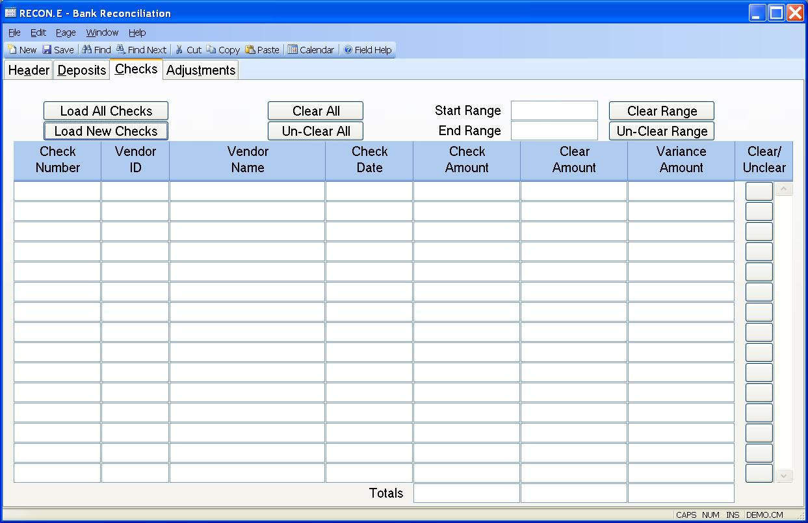

##  Bank Reconciliation (RECON.E)

<PageHeader />

##  Checks

**Load All Checks** This button is used to load all uncleared checks up to the
end date entered on the first tab. If checks have already been entered into
the section below, pressing this button will over-write that data. If you only
want to load in checks that have been entered since the RECON record was last
updated, use the 'LOAD NEW CHECKS' button.  
  
**Load New Checks** Press this button to load in any checks that have been
created since the RECON record was last updated. This option will not over-
write any check data that has already been entered into this procedure. This
option is helpful when you are reconciling daily or weekly and not just at
month end.  
  
**Clear All** Use this button to clear all checks listed below. Please note
that if some of the checks do not clear after selecting this option, it is
because the check has already been cleared. An uncleared check should be
referenced in this recon record if it was uncleared as of the ending statement
date referenced on the header tab in this procedure.  
  
**Un-Clear All** This button will flag all check records below as uncleared.  
  
**Start Range** Enter the starting check number for the range you wish to set.  
  
**End Range** Enter the ending date for the range.  
  
**Clear Range** This button will clear the range of checks. Please note that
if some of the checks do not clear after selecting this option, it is because
the check has already been cleared. An uncleared check should be referenced in
this recon record if it was uncleared as of the ending statement date
referenced on the header tab in this procedure.  
  
**Un-Clear Range** Use this button to un-clear the range of checks.  
  
**Check** This field contains the list of checks which were uncleared before
this reconciliation occurred.  
  
**Vendor** This field contains the vendor number, if present, from the Check
record.  
  
**Name** This field contains the vendor name for the associated check record.
If the check is a miscellaneous check (i.e. no vendor number), then this field
will contain the first line of the notes.  
  
**Check Date** This field contains the check date.  
  
**Check Amt** This field contains the amount of the check, as found in the
check record.  
  
**Check Clear Amt** Enter the cleared amount, as it appears on the bank
statement. This amount is defaulted to the check amount any may be changed, if
different.  
  
**Check Variance** This field contains the difference between the check amount
and the cleared amount and is for reference only.  
  
**** This button will toggle the cleared data on the associated check.  
  
**Total Check Amt** This field contains the total of the check amount column.  
  
**Total Check Clear Amt** This field contains the total of the check cleared
amount column.  
  
**Total Check Variance** This field contains the total of the check variance
amount column.  
  
  
<badge text= "Version 8.10.57" vertical="middle" />

<PageFooter />