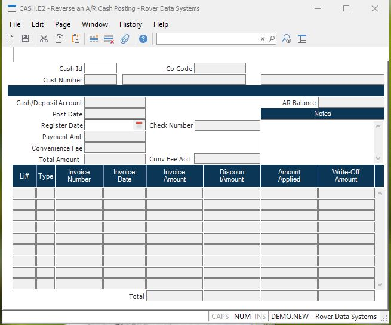

##  Reverse an A/R Cash Posting (CASH.E2)

<PageHeader />

##

**Cash Id** This is a sequentially assigned number used to identify the cash
batch you are entering. The number will be assigned and displayed when the
record is filed.  
  
**Co.Code** Company code entered for this cash record.  
  
**Cust Number** Enter the customer number who is making the payment. The
customer name will display for verification as well as a portion of the
address.  
  
**Cash Account** Enter the General Ledger account number to be debited for the
cash amount. This number will default from the AR Control record and can be
overridden if required.  
  
**Post Date** Enter the transaction date which should indicate when the
payments were applied. This date will be used to calculate any discounts which
should be allowed.  
  
**Date Reversed** The date which will be assigned to ARREG records created by
this reversal. If you are correcting a mistake from a previous, still open
period, you will want to enter a date in that period.  
  
**Check Number** Enter the number from the check which the customer is using
to make the payment. If you are not applying a check, but are 'netting'
invoices, enter any code you wish which will indicate what you are doing.  
  
**Check Amount** Enter the net amount (face value) of the check. This is the
actual amount of money being applied.  
  
**AR Balance** The field displays the AR Balance before this record is filed.  
  
**Li#** Enter a line item number which will uniquely identify each invoice
being paid. This will be a sequential number.  
  
**Type** This is the AR type: IN - Invoice CM - Credit Memo OA - On  
  
**AR Id** The record ID in the AR file of the item being paid. This can be an
invoice, credit memo or an on-account record.  
  
**Inv Date** The invoice date from the AR record.  
  
**On Account** The amount of the check which was posted as an On Account
amount AR item.  
  
**Disc Amount** The discount amount being allowed for this invoice, base upon
the terms and invoice date. This amount is automatically defaulted, but can
then be changed as required.  
  
**Amount** The application amount for this transaction. This field will
default to the invoice balance, less discount, provided that the check running
balance is sufficient. If not, this amount will default to the remainder of
the running balance.  
  
**Write Off Amount** The amount of the invoice on this line which was written
off.  
  
**Tot OA Amount** The total of all OA amounts on the invoices listed in this
column.  
  
**Tot Disc Amount** The total of all discount amounts allowed.  
  
**Total Amount** The total of all applied amounts entered.  
  
**Total Write Off** The total of all write offs entered.  
  
**Cust Name** The name of the customer, as read from the CUST file.  
  
**Address** This portion of the address is used to verify you have selected
the proper customer.  
  
**Notes** Contains the notes from the cash receipt being reversed.  
  
  
<badge text= "Version 8.10.57" vertical="middle" />

<PageFooter />