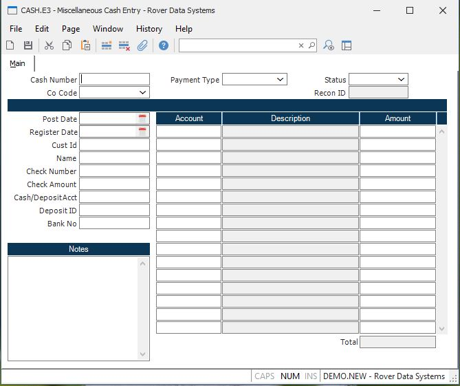

##  Miscellaneous Cash Entry (CASH.E3)

<PageHeader />

##  Main

**Cash#** If you are entering a new cash item, leave this field null and the
next sequential cash number will be assigned at file time. If you wish to
review a previously posted entry, enter the cash number of that item.  
  
**Co Code** Enter the company code this record should be issued to. The
company code must be predefined in the CO.CONTROL procedure. If only one code
exists, it will automatically be inserted into the procedure. If required, the
company code is one of several fields that can be changed on existing records.  
  
**Post Date** Enter the date on which the cash is to be posted. This date will
determine the period in the general ledger into which the cash will post. If
required, the post date can be changed on existing records provided the new
date falls into an open fiscal period.  
  
**Register Date** Enter the date that should be posted to the register (ARREG)
records when deleting the cash record. When creating a cash record, the
register date will be the same as the post date and cannot be changed by the
user. When deleting the cash record, the post date will load into this field
for you but can be changed as required. If the post date falls into a closed
fiscal period, you will need to change this date to one that falls within an
open fiscal period before the record can be deleted.  
  
**Cust** If the payment was received for an existing customer, enter the customer id in this field. The name entered in [ CUST.E ](../../CUST-E/README.md) for the customer will be loaded into the NAME field for you. If required, the customer number is one of several fields that can be changed on existing records.   
  
**Misc Name** Enter the name of the company or individual the payment was
received from in this field. If a customer id has been entered, the name will
be loaded into this field for you. If required, the custom name is one of
several fields that can be changed on existing records.  
  
**Check Number** If the receipt being processed was a check, enter the check
number here. For cash items, you may either enter "CASH" here, or leave this
field empty.  
  
**Amount** Enter the amount of the cash or check being processed.  
  
**Cash.Account** Enter the cash account number into which the amount is to be
deposited.  
  
**Deposit ID** This optional field may be used to group a series of cash entries by a common deposit number and later print them on a single cash deposit report. Deposit slips may ,also, be printed via [ CASH.F1 ](../../../AR-REPORT/CASH-F1/README.md) . If you will be using [ RECON.E ](../../RECON-E/README.md) to reconcile your bank statements, a deposit id is recommended. If required, the deposit id is one of several fields that can be changed on existing records.   
  
**Bank Number** Enter the bank number for this cash transaction. This number will print on the deposit slip form , [ CASH.F1 ](../../../AR-REPORT/CASH-F1/README.md) . If required, the bank number is one of several fields that can be changed on existing records.   
  
**Notes** Enter any notes desired. If required, the notes are one of several
fields that can be changed on existing records.  
  
**Account** Enter the account number which will be used to offset the cash
account when this record is filed. Multiple account numbers and amounts are
allowed.  
  
**Description** Description of account number will display here after the
account number is entered for verification.  
  
**Amount** Enter the amount to be distributed to the corresponding account
number. The total of these amounts must equal the cash/check amount above
before the record may be filed.  
  
**Total** The total amount of the items specified. This is used to display the
running total of the items being distributed.  
  
**Status** On existing records, the status of the transaction will be
displayed in this field. This field cannot be updated manually.  
  
  
<badge text= "Version 8.10.57" vertical="middle" />

<PageFooter />