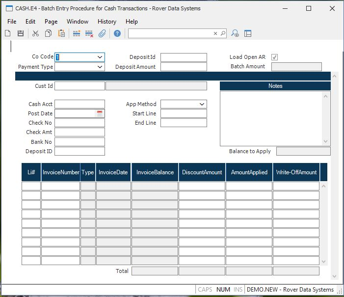

##  Batch Entry Procedure for Cash Transactions (CASH.E4)

<PageHeader />

##

**Cash Id** This is a sequentially assigned number which will be assigned to
each cash transaction when the record is saved.  
  
**Co Code** Enter the company code the check was issued for. Payment can only
be applied for A/R records with a matching company code. The company code must
be pre-defined in the CO.CONTROL procedure.  
  
**Header Deposit Id** Enter the deposit id for the following cash
transactions. This number can be changed as required for a given cash
transaction.  
  
**Deposit Amount** Enter the deposit amount for this batch. The total of all
checks entered must equal this amount before the record can be saved.  
  
**Load Open AR** Check this box to load all open AR items.  
  
**Batch Amount** This field contains the total check amounts that have been
entered for each customer.  
  
**Cust Number** Enter the customer number who is making the payment. If you do
not know the customer's  
number, there is an option in the help menu for this prompt which allows you
to select the  
customer by name.  
  
**Customer Name** The name of the customer as it appears in [ cust.e ](cust-e/README.md) .   
  
**Cash Account** Enter the General Ledger account number to be debited for the
cash amount. This number will default from the AR Control record and can be
over-ridden if required.  
  
**Post Date** Enter the transaction date which should indicate when the
payments were applied. This date will be used to calculate any discounts which
should be allowed.  
  
**Check Number** Enter the number from the check which the customer is using
to make the payment. If you are not applying a check, but are 'netting'
invoices, enter any code you wish which will indicate what you are doing.  
  
**Check Amount** Enter the net amount (face value) of the check. This is the
actual amount of money being applied.  
  
**Bank Number** Enter the bank number for this cash transaction. This number will print on the deposit slip form , [ CASH.F1 ](../../../AR-REPORT/CASH-F1/README.md) .   
  
**Deposit Id** This field is used to assign a "deposit batch" number to a series of cash entries. These cash entries may then be reported as a group. Deposit slips may ,also, be printed via [ CASH.F1 ](../../../AR-REPORT/CASH-F1/README.md) . If you will be using [ RECON.E ](../../RECON-E/README.md) to reconcile your bank statements, a deposit id is recommended.   
  
**App Method** Select the method the check amount is to be applied to
invoices:  
Specific - Apply amounts to specific invoices  
Oldest - Apply to oldest invoice first  
Range - Apply to a range of  
  
**Start Line** If application type 3 was selected, enter the starting line
item to be used for the range.  
  
**End Line** If application type 3 was selected, enter the ending line item to
be used for the range.  
  
**Balance to Apply** This is a running balance for this Cash record. It
displays the amount of the check yet to be applied.  
  
**Notes** Enter any notes desired.  
  
**Line Item** Enter a line item number which will uniquely identify each
invoice being paid. This will be a sequential number. This field (and all
associated data) will automatically be loaded if the user opted to load all
customer data. Additional lines may be added to create credit and/or debit
memos.  
  
**Invoice Number** The record ID in the AR file of the item being paid. This
can be an invoice, credit memo or an on-account record. To create new
credit/debit memos, either leave this field empty or enter a number which does
not currenty exist on the AR file.  
  
**Type** This is the AR type: IN - Invoice CM - Credit Memo DM = Debit OA - On  
  
**Invoice Date** The invoice date from the AR record.  
  
**Invoice Balance** The balance of the AR item.  
  
**Discount Amount** The discount amount being allowed for this invoice, base
upon the terms and invoice date. This amount is automatically defaulted, but
can then be changed as required.  
  
**Amount Applied** The application amount for this transaction. This field
will default to the invoice balance, less discount, provided that the check
running balance is sufficient. If not, this amount will default to the
remainder of the running balance. To create new credit and/or debit memos,
enter the desired amount in this field. For credit memos, enter the number as
a positive number.  
  
**Write Off Amount** The amount of the invoice on this line which was written
off.  
  
**Total Invoice Balance** The total of all the invoices listed in this column.  
  
**Total Discount Amount** The total of all discount amounts allowed.  
  
**Total Amount Applied** The total of all applied amounts entered.  
  
**Total Write Off Amount** The total of all write offs entered.  
  
  
<badge text= "Version 8.10.57" vertical="middle" />

<PageFooter />