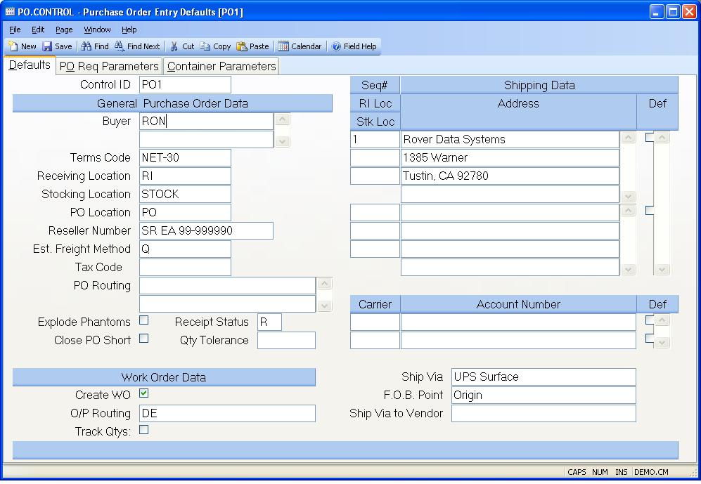

##  Purchase Order Entry Defaults (PO.CONTROL)

<PageHeader />

##  Defaults

**ID** The control id is the company code (as defined on screen 2 of
CO.CONTROL) preceded by "PO". If you only have one company code the control id
will automatically be inserted into this procedure for you. If you have
multiple company codes you may select from a list of available companies or
you may enter the id directly e.g. PO3. This record contains the default
information used in the PO module by company code.  
  
**Buyer** Enter the buyer names that can be used in [ VENDOR.E ](../../../../../../../../../../rover/AP-OVERVIEW/AP-ENTRY/VENDOR-E) , [ POREQ.E ](../../../../../../../../../../rover/AP-OVERVIEW/AP-ENTRY/VENDOR-E/VENDOR-E-1/POREQ-E) and [ PO.E ](../../../../../../../../../../rover/AP-OVERVIEW/AP-ENTRY/AP-E/AP-E-1/CURRENCY-CONTROL/PO-E) . If only one buyer name is listed, it will be defaulted into the purchase order when there is no entry for buyer in the associated vendor record.   
  
**Terms code** Enter the default terms code to be used for purchase order
entry when there is no terms code defined in the associated vendor record.  
  
**Receiving location** Enter the default receiving location for purchase order
entry.  
  
**Stock location** Enter the default stocking location for purchase order
entry.  
  
**PO location** Enter the inventory location which defines the purchases
clearing account. The location is used as the FROM location for receipt
transactions and the TO location for receipts debit transactions.  
  
**Reseller Number** Enter the company's reseller number in this field. The
reseller number is printed on the blank paper purchase order form.  
  
**Est Freight Factor** If estimated freight is to be entered on purchase
orders, the amount will be prorated across the PO line items at the time of
receipt and added to each part's unit cost for calculating the average
inventory cost. Enter the factoring method for prorating the freight across
the line items. The methods are by quantity, dollars, or weight. See list of
valid values.  
  
**Tax Code** Enter the default tax code for purchase order entry. Sales tax
will be calculated and added to the AP records based on this tax code rate
from the PTAX file.  
  
**PO Routing** Enter the text to appear on the bottom of the different copies
of the blank paper form. For example, entries of Purchasing, Accounting and
Receiving will cause three copies to be printed with the text of one of the
routings appearing at the bottom of each form.  
  
**Explode Phantoms** Check this box if you want to receive the components of phantom assemblies when receiving a PO line item that is a phantom part. If unchecked, then the phantom assembly will be received as a normal part number. This setting will default into [ PO.E ](../../../../../../../../../../rover/AP-OVERVIEW/AP-ENTRY/AP-E/AP-E-1/CURRENCY-CONTROL/PO-E) for each purchase order but can be changed for an individual PO.   
  
**Do not Backorder Po** Check this box if you do not want a backorder created for any line item on a purchase order that is received short. When the receipt is processed via [ receipts.e ](receipts-e/README.md) , a check mark will default into the "close li" field for you but can be removed.   
  
**Receipt Status** Enter the default you wish to use for the status field in [ RECEIPTS.E ](../../../../../../../../../../rover/AP-OVERVIEW/AP-ENTRY/AP-E/AP-E-1/MSHIP-E/RECEIPTS-E2/RECEIPTS-E3/RECEIPTS-E) and [ RECEIPTS.E2 ](../../../../../../../../../../rover/AP-OVERVIEW/AP-ENTRY/AP-E/AP-E-1/MSHIP-E/RECEIPTS-E2) . Using an "N" status will allow yu to save a receipt without processing it. For example, you may wish to save an unfinished receipt, then come back to it later. A status of "R" will immediately post the receipt to inventory and the purchase order.   
  
**Qty Tolerance** Enter the quantity tolerance that will be used during the
receiving process. If the quantity being received is over or under this
tolerance percentage, the receipt process will not be allowed.  
  
**Create Work Order?** Check this box if you wish to generate a work order from [ PO.E ](../../../../../../../../../../rover/AP-OVERVIEW/AP-ENTRY/AP-E/AP-E-1/CURRENCY-CONTROL/PO-E) for outside processing items. An outside processing work order is issued for the same part number as entered in the purchase order.   
  
**Outside Processing Routing** Enter the routing id that should be used when creating work orders from [ po.e ](po-e/README.md) when a routing has not been defined in [ parts.e ](parts-e/README.md) for the selected part.   
  
**Track Qtys** Check this box, if you wish to track the quantities purchased
and received by operation. If this box is checked, and the purchase order was
created for an outside processing charge the operation must be entered on the
po.  
  
**Shipping Sequence No** Enter the sequence number to be assigned to this
address.  
  
**Rec Loc** Enter the default receiving inspection location for this shipping
address. If entered, this will override the general receiving location.  
  
**Stock Loc** Enter the default stock location for this shipping address. If
entered, this will override the general stocking location.  
  
**Shipping Address** Enter the shipping address for this sequence number. In purchase order entry ( [ PO.E ](../../../../../../../../../../rover/AP-OVERVIEW/AP-ENTRY/AP-E/AP-E-1/CURRENCY-CONTROL/PO-E) ), the users will be able to load in these addresses.   
  
**Default Address** Check this box if the associated address should be loaded
into the purchase order when multiple addresses have been entered. If only one
address exists, it will be loaded into the p/o for the user. If multiple
address exist and this box has not been checked for any of them, no address
will default into the purchase order for the user.  
  
**Freight Carrier** Enter the carrier code for which you wish to define an
account number.  
  
**Account Number** Enter the company account number for the associated carrier that should be loaded into the purchase order. The purchase order entry procedure ( [ PO.E ](../../../../../../../../../../rover/AP-OVERVIEW/AP-ENTRY/AP-E/AP-E-1/CURRENCY-CONTROL/PO-E) ) will attempt to load in the account number for the approriate carrier based on the shipping method found in the p/o.   
  
**Default** Check this box if you wish the associated account number to be
automatically loaded into the purchase order for you when this material will
be shipped by this carrier.  
  
**Ship via** Enter the default method of shipment for purchase order entry
which should be used when there is no default specified in the associated
vendor record.  
  
**F.O.B. point** Enter the default F.O.B. point for purchase order entry which
should be used when there is no F.O.B. specified in the associated vendor
record.  
  
**Ship Via to Vendor** Enter the default method of shipment when returning items to a vendor. This will be used in [ MSHIP.E ](../../../../../../../../../../rover/AP-OVERVIEW/AP-ENTRY/AP-E/AP-E-1/MSHIP-E) and for debit receipts processing when a shipment to the vendor is created. If you are using the UPS interface for miscellaneous shipments, this must be a valid method on [ SHIP.CONTROL ](../../../../../../../../../../rover/AP-OVERVIEW/AP-ENTRY/AP-E/AP-E-1/MSHIP-E/MSHIP-E-1/SHIP-CONTROL) .   
  
  
<badge text= "Version 8.10.57" vertical="middle" />

<PageFooter />