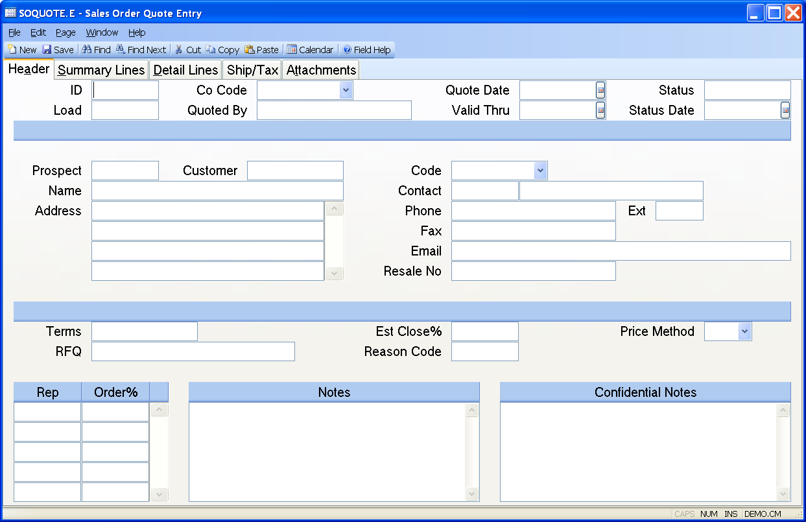

##  Sales Order Quote Entry (SOQUOTE.E)

<PageHeader />

##  Header

**ID** Enter the quote ID which you wish to enter or update. To assign the
next sequential quote number, leave this field null.  
  
**Load** If you wish to load an existing quote, enter that number here. All
information from that quote record will be loaded. This field is only used
with new records and is not functional for existing quotes.  
  
**Co Code** Enter the company code for this quote. The company code must be
predefined in the CO.CONTROL procedure. If only one code exists, it will
automatically be inserted into this procedure for you.  
  
**Quoted.By** Enter the name of the person who is entering the quote.  
  
**Date** Enter the date on which the prices are being quoted.  
  
**Valid Thru** The date through which this quote is valid. This date is originally defaulted as the quote date plus the number of days identified in the [ QUOTE.CONTROL ](QUOTE-CONTROL/README.md) record.   
  
**Status** The current status of this quote. This is a user defined field and
is associated with the status date. An empty status field is assumed to be an
active quote. Any code entered will set this quote to an "un-open" status.  
  
**Status Date** The date which the status was changed / set.  
  
**Prospect** If this quote is being made to a prospect (as opposed to a
customer), enter the prospect number here. If you are quoting to a customer,
leave this field null and use the customer number field.  
  
**Customer** If the prices are being quoted to an existing customer, enter the
number here. This field is  
not required.  
  
**Name** The name of the customer / prospect to whom the quote is being made.  
  
**Address** The address of the prospect / customer.  
  
**Code** Enter the code to be used for pricing.  
  
**Contact Id** Enter the ID of the contact associated with the order. The
system will load the default contact automatically from the list of contacts
in the prospect or customer master record depending on which is being
referenced. You may select another contact by typing all or part of a word in
the contact's name or use the right click menu to select from a list of
contacts associated with the prospect. The right click menu also includes an
option to add a new contact to the system. If a new contact is created it will
be added to the list of prospect or customer contacts when the quote is saved.  
  
**Contact** The person to contact at the prospect / customer.  
  
**Phone** The phone number of the prospect / customer.  
  
**Ext** Enter the phone extension for the associated contact.  
  
**FAX** This field contains the FAX number to which the quote will be sent.  
  
**Email** This field contains the Email address to which the quote will be
emailed.  
  
**Resale No** Enter the resale number, if applicable, associated with the
customer.  
  
**Terms Code** Enter the terms code to be assigned to this quote.  
  
**CustRFQ** Enter the customer's RFQ for reference.  
  
**Est Close%** Enter the estimated percentage of close for this quotation.  
  
**Reason Code** Enter any user defined reason code for this quotation. For
example, this can be used as a reason code for losing the quote.  
  
**Cost Method** This field will control how line item prices will be derived. It originally defaults from the [ QUOTE.CONTROL ](QUOTE-CONTROL/README.md) screen and can be changed per quote as required.   
  
**Rep** The sales rep who is responsible for this quote.  
  
**Order.Pct** This field contains the order percent to be used for the
associated rep when calculating  
  
**Notes** Enter miscellaneous notes as required.  
  
**Confidential Notes** Enter any confidential notes required.  
  
  
<badge text= "Version 8.10.57" vertical="middle" />

<PageFooter />