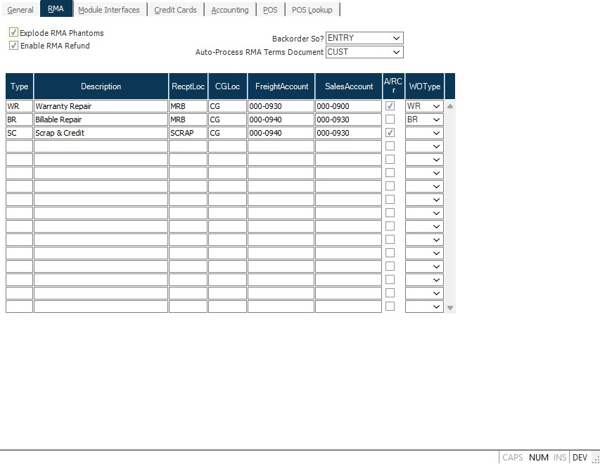

##  Marketing Module Controls and Defaults (MRK.CONTROL)

<PageHeader />

##  RMA

**Explode Phantoms** Check this box if you want to receive the components of phantom assemblies when receiving an RMA line item that is a phantom part. If unchecked, then the phantom assembly will be received as a normal part number. This setting will default into [ RMA.E ](RMA-E/README.md) for each line item but can be changed for an individual RMA item.   
  
**Backorder So** If you wish to backorder the sales order, you have the option to create the backorder at the time the rma is entered or during the receiving process. If you select the first option, the sales order will be backordered via [ RMA.E ](RMA-E/README.md) . If you make any changes to the quantity to existing records in [ RMA.E ](RMA-E/README.md) , the backorder quantity on the sales order will be updated to reflect those changes. If you wish to backorder the sales order during the receiving process, the sales order will be backordered when the RMA receipt is posted via [ RMAREC.P1 ](RMAREC-P1/README.md) . If no entry is made into this field and the "BACKORDER?" box is checked in [ RMA.E ](RMA-E/README.md) , the sales order will be backordered from [ RMA.E ](RMA-E/README.md) . Please note, that if you change this option, you may end up backordering the sales order at both entry and receipt time.   
  
**Type** Each RMA that is entered must be defined by a type code that
indicates default entries and actions to be taken. Define each of the valid
RMA type codes along with their associated settings.  
  
**RMA Type Description** Enter the description of the associated RMA type
code.  
  
**RMA Receipt Location** Enter the location into which items are to be
received from RMAs with the associated code. If this field is left blank and
the original shipment or sales order is entered, then the original ship from
location will be used.  
  
**RMA CG Location** Enter the cost of goods location debited for items
received on RMAs with the associated code. If this field is left blank and the
original shipment or sales order was identified, the original CG location will
be used.  
  
**RMA Freight Account** Enter the account number to be used for any freight
charges being reversed on RMAs with the associated code. If this field is left
blank and the original shipment was entered, the original freight account will
be used.  
  
**RMA Sales Account** Enter the sales account to be credited when RMAs
containing the associated code are received. If this field is left blank and
the original shipment was entered, the original sales account will be used.  
  
**RMA Credit** Check this box if RMAs of the associated type are to create
credit memos or invoices in accounts receivable.  
  
**WO Type** Enter the repair type code to be assigned to work orders that are
created for the associated RMA type code. Repair codes are setup in  

### Enable RMA Refund 

Enables the ability to process RMAs in Rover Web Point of Sale.

### Auto-Process RMA Terms Document

Selects what document to reference when determining if an RMA Receipt created via Rover Web Point of Sale can be automatically confirmed and posted to an AR Credit Memo. This is determined using the Auto-Process RMA setting in TERMS.E for the terms code associated with the document selected (AR for the item being RMA'ed or Customer) 
  
  
<badge text= "Version 8.10.57" vertical="middle" />

<PageFooter />