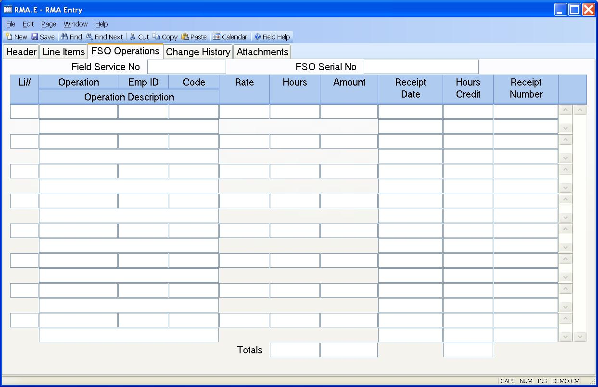

##  RMA Entry (RMA.E)

<PageHeader />

##  FSO Operations

**FSO Oper Li** Enter the line item number of the FSO operation being
credited. This is usually entered as a sequential number beginning with one
(1). All of the operation data will be loaded automatically if a field service
order was entered.  
  
**Operation** Enter the operation code that identifies the FSO operation
performed.  
  
**Oper Desc** Enter the description of the operation performed. This will be
loaded automatically when an operation code has been entered.  
  
**Oper Emp Id** Enter the identification number of the employee who performed
the operation.  
  
**Service Code** Enter the service code that identifies how and if this
operation is to be credited to the customer.  
  
**Oper Rate** Enter the rate at which this operation is to be credited to the
customer. The system will load the rate based on the zone and service code
entered. It may be changed as required.  
  
**Oper Hours** Enter the number of hours to be credited for the operation.
Partial hours are stated as a fraction of an hour. For example, one hour and
fifteen minutes would be entered as 1.25 not 1:15.  
  
**Oper Amount** Shows the amount to be credited for the associated operation.
This is calculated as the hours times the rate.  
  
**Date Credit** Displays the dates of any receipts made against the
assocaiated RMA FSO operation. The field is for information only and may not
be changed.  
  
**Hours Credited** Displays the hours credited on the associated date for the
RMA FSO operation. This field is for information only and may not be changed.  
  
**Credit Receipt** Displays the number assigned to the receipt on the
associated date. This information may not be changed in this form.  
  
**Total Hours** Displays the total number of hours for all operations
performed on the service order.  
  
**Total Amount** Contains the sum of the labor amounts for each operation
entered.  
  
**FSO#** Contains the field service order number for display purposes only.  
  
**FSO Serial #** Contains the serial number from the Field Service order for
display purposes only.  
  
**Total Hours Credit** Displays the total number of hours credited for all
operations on this RMA.  
  
  
<badge text= "Version 8.10.57" vertical="middle" />

<PageFooter />